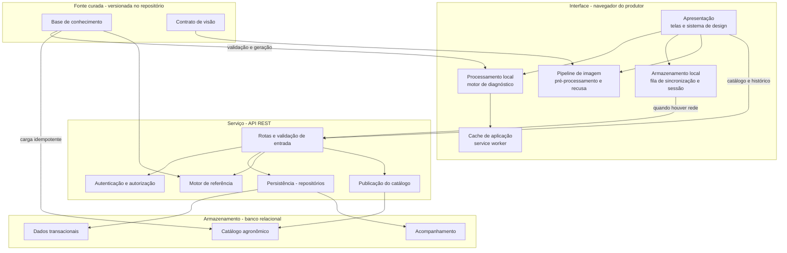

# Arquitetura

> Visão arquitetural consolidada do AgroScan. O detalhamento por fluxo, com
> diagramas de sequência e implantação, está no
> [Artefato 3, seção 2](../entregas/artefato-3-gestao-do-produto.md#2-design-arquitetural).
> O modelo de dados completo está em
> [`docs/modelo-de-dados.md`](https://github.com/gabicaldana/AgroScan2/blob/main/docs/modelo-de-dados.md)
> no repositório de código.

| Campo | Informação |
| --- | --- |
| Projeto | AgroScan - PWA para diagnóstico de doenças em hortaliças |
| Equipe | Gabriela Pedersoli Caldana (22404253) · Thaís Regina Dias da Mota (22403754) |
| Última revisão | 12/09/2026 - Sprint 1 |
| Repositório de código | https://github.com/gabicaldana/AgroScan2 |

---

## 1. Contexto técnico

O ambiente de uso determina a arquitetura, e não o contrário. O usuário está no
canteiro, ao ar livre, com um celular de entrada, e **frequentemente sem sinal
de internet**. Daí decorrem duas restrições que não são negociáveis:

**1. Funcionar offline é requisito funcional.** Se o cálculo do diagnóstico
depende de uma chamada de rede, o sistema falha exatamente no lugar onde precisa
funcionar. Não existe degradação graciosa aceitável aqui: a resposta tem que sair
sem rede.

**2. Um sistema que sempre responde, mente.** Um diagnóstico devolvido com ares
de certeza sobre um quadro incompleto é pior do que nenhum, porque induz à
aplicação errada - que custa dinheiro, não resolve e deixa a doença avançar. A
arquitetura tem que ser capaz de representar e transmitir incerteza.

Essas duas restrições produzem o princípio organizador do sistema:

> **O cliente é autoridade sobre a resposta. O servidor é autoridade sobre o registro.**

### 1.1 Restrições adicionais

| Restrição | Origem | Consequência arquitetural |
| --- | --- | --- |
| Camada gratuita de serviços em nuvem (RNF22) | Acadêmica | Ambiente serverless, com inicialização a frio e limite baixo de conexões ao banco |
| Publicação por URL pública sem loja (RNF25) | Produto | PWA, e não aplicativo nativo |
| Sem sincronização em segundo plano no iOS (RNF28) | Plataforma | O envio da fila é disparado na abertura do aplicativo e no retorno da conexão |
| Banco de dados relacional (RNF24) | Acadêmica | PostgreSQL; as agregações dos relatórios são feitas em SQL |
| Equipe de duas pessoas | Projeto | A curadoria agronômica é o gargalo; a arquitetura precisa permitir que ela avance sem tocar no código |

## 2. Componentes



### 2.1 Responsabilidades e fronteiras

| Componente | Responsabilidade | Não é responsável por |
| --- | --- | --- |
| **Apresentação** | Renderizar telas, capturar sintomas, exibir laudo e incerteza | Calcular diagnóstico |
| **Processamento local** | Calcular compatibilidade e pergunta de desempate sobre a base embutida | Persistir qualquer coisa |
| **Armazenamento local** | Guardar a fila de consultas e a sessão autenticada | Ser fonte de verdade de histórico entre dispositivos |
| **Cache de aplicação** | Servir a casca da aplicação e seus arquivos sem rede | Cachear respostas da API |
| **Pipeline de imagem** | Transformar pixel em tensor e decidir quando recusar | Classificar - o modelo não existe ainda |
| **Rotas e validação** | Validar entrada contra o catálogo antes de tocar o banco | Regra de diagnóstico |
| **Autenticação** | Derivar e conferir senha, emitir e validar token | Autorização por horta *(Sprint 3)* |
| **Persistência** | Gravar e ler consultas, garantindo idempotência | Decidir hipótese |
| **Motor de referência** | Ser a definição normativa da regra de diagnóstico | I/O de qualquer tipo |
| **Publicação do catálogo** | Servir catálogo e versão para sincronização | Curadoria |
| **Banco relacional** | Guardar o que é compartilhado entre pessoas e dispositivos, e agregar | Calcular diagnóstico |

**A fronteira que mais importa:** o motor de diagnóstico não faz I/O. Isso é o
que permite que a mesma regra exista em três lugares - módulo puro, rota HTTP e
navegador - e seja verificada por igualdade exata sobre as mesmas fixtures.

## 3. Integrações

| Integração | Finalidade | Natureza | Risco |
| --- | --- | --- | --- |
| **Embrapa Hortaliças, IAC** | Fonte técnica da curadoria de doenças, sintomas e manejo | Consulta humana, não automatizada | Baixo - material público e estável |
| **AGROFIT/MAPA** | Referência de ingredientes ativos e registro por cultura/praga | Consulta humana | Médio - o registro muda; por isso o sistema apresenta o ingrediente como referência e **remete o usuário ao AGROFIT**, em vez de afirmar registro |
| **Repositório Digipathos (Embrapa)** | Candidato a acervo de imagens para o modelo de visão | Download de dados, se a auditoria aprovar | Alto - cobertura de hortaliças não verificada (risco R04) |
| **Vercel** | Publicação do front-end e da função Python da API | Plataforma | Médio - inicialização a frio afeta RNF03 |
| **PostgreSQL gerenciado** | Banco relacional | Plataforma | Médio - limite de conexões no plano gratuito (risco R05) |

**Nenhuma integração é necessária para o diagnóstico funcionar.** É essa
propriedade que sustenta RNF01: o produtor no canteiro não depende de nenhum
terceiro.

## 4. Dados

### 4.1 Origem e circulação

O conteúdo agronômico é escrito **uma vez**, em
`data/base_conhecimento.json`, e derivado por geração para os três lugares onde
precisa existir. Nunca é copiado à mão.

```
base_conhecimento.json ──┬─ validação        recusa base incoerente
                         ├─ fixtures         contrato de teste entre implementações
                         ├─ módulo TS        embutido no pacote do aplicativo
                         └─ carga (seed)     PostgreSQL, UPSERT idempotente
```

Quatro artefatos são gerados e versionados, cada um com teste de frescor, e a
integração contínua falha se algum divergir de sua fonte (RNF20).

### 4.2 Categorias e tratamento

| Categoria | Exemplos | Onde reside | Cuidados |
| --- | --- | --- | --- |
| **Catálogo agronômico** | Culturas, sintomas, doenças, manejos | Repositório (fonte), pacote do app, banco | Público; carregado, nunca digitado |
| **Identidade** | Nome, e-mail, hash de senha | Banco | Senha com scrypt e sal por senha (RNF12); exclusão efetiva (RNF17) |
| **Histórico de consulta** | Cultura, sintomas marcados, hipóteses, data, versão do catálogo | Fila local e banco | Isolado por usuário, verificado por teste |
| **Localização** | Latitude e longitude da consulta | Banco, opcional | Sempre opcional, com consentimento explícito (RNF16); coordenada pela metade é recusada |
| **Imagem** | Foto da planta | **Fora do banco** | Referência no banco, arquivo em armazenamento de objetos |

### 4.3 Consistência e rastreabilidade

Três decisões de dados sustentam a confiabilidade do histórico:

**`offline_id` com restrição de unicidade.** Cada consulta nasce no aparelho com
um identificador próprio. Reenviar a fila é o caso normal, não a exceção - o
aplicativo não sabe se um envio anterior chegou antes de a conexão cair. A
garantia de não duplicar mora no **banco**, não apenas no código do cliente.

**`versao_catalogo` gravada em cada consulta.** Um diagnóstico feito com a base
v1 e reinterpretado com a v3 é reprodutivelmente diferente. Guardar a versão é o
que mantém o histórico auditável enquanto a curadoria avança.

**Última escrita prevalece** em edição concorrente de um mesmo registro do
caderno (RN11). É adequado ao domínio: o dado é de um único autor, e conflito
real é raro.

## 5. Decisões técnicas

Cada decisão está registrada como ADR em [`docs/decisoes/`](decisoes/).

| ADR | Decisão | Alternativa principal descartada |
| --- | --- | --- |
| [0001](decisoes/adr-0001-diagnostico-no-cliente.md) | Diagnóstico calculado no cliente | API de diagnóstico como caminho único |
| [0002](decisoes/adr-0002-indice-ponderado.md) | Índice de similaridade ponderado | Classificador probabilístico treinado |
| [0003](decisoes/adr-0003-base-como-fonte-unica.md) | Base curada como fonte única, derivada por geração | Catálogo mantido diretamente no banco |
| [0004](decisoes/adr-0004-paridade-entre-motores.md) | Motor duplicado com paridade verificada por fixtures | Implementação única compilada para os dois ambientes |
| [0005](decisoes/adr-0005-contrato-de-preprocessamento.md) | Contrato de pré-processamento definido pelo projeto | Reproduzir o PIL bit a bit em TypeScript |
| [0006](decisoes/adr-0006-recusa-sobre-logits-crus.md) | Recusa calculada sobre logits crus | Recusa sobre probabilidade renormalizada por cultura |
| [0007](decisoes/adr-0007-pwa-em-vez-de-nativo.md) | PWA em vez de aplicativo nativo | Aplicativo Android nativo |
| [0008](decisoes/adr-0008-hierarquia-de-entrada.md) | Sintomas como tela inicial, câmera fora da navegação | Manter a captura por foto como tela inicial |
| [0009](decisoes/adr-0009-idempotencia-no-banco.md) | Idempotência da sincronização garantida no banco | Controle apenas no cliente |

### 5.1 Escolhas de tecnologia

| Camada | Tecnologia | Motivo |
| --- | --- | --- |
| Front-end | Next.js 16 · React 19 · TypeScript · Tailwind CSS 4 | PWA instalável, tipagem estática no motor portado, sistema de design expressável em utilitários |
| Back-end | FastAPI (Python) | O motor de referência e o tooling de dados já são Python; validação declarativa e documentação de API automática |
| Banco | PostgreSQL | Requisito de banco relacional (RNF24); agregações dos relatórios em SQL |
| Testes | `unittest` (Python) e runner nativo do Node | Zero dependência de framework de teste; o runner do Node executa TypeScript sem passo de build |

**Python e TypeScript têm papéis separados, e isso é deliberado.** Python fica
com a validação da base, o motor de referência e o tooling de dados.
TypeScript fica com a aplicação. O porte em TS é verificado contra o Python por
fixtures compartilhadas.

## 6. Riscos

| ID | Risco técnico | Impacto | Mitigação |
| --- | --- | --- | --- |
| R02 | Descarte do armazenamento local em iOS após ~7 dias sem uso | Perda do catálogo em cache e das consultas não enviadas | Catálogo reconstruível na abertura seguinte com rede; fila esvaziada na abertura; orientação ao usuário de iOS (US40) |
| R04 | Acervo de imagens sem cobertura suficiente de hortaliças | A identificação por imagem não sai do condicionado | Escopo fora do núcleo; RF11 garante que o sistema declare a indisponibilidade em vez de chutar |
| R05 | Esgotamento de conexões do banco em ambiente serverless | API indisponível sob concorrência | Conexão agrupada em execução e direta apenas para migração; reaproveitamento entre requisições; tempo limite configurado |
| R06 | Ambiente publicado defasado em relação ao código | Demonstração e avaliação sobre versão errada | Conferência da versão publicada no Definition of Done (critério C11) |
| R07 | Dependência de teste ausente na lista de dependências | 22 testes de integração da API não executam de forma confiável; RNF19 e RNF20 ficam sem evidência | Declarar a dependência e verificar que o CI executa - e não pula - os testes da API |
| R08 | Divergência silenciosa entre as três implementações do motor | O usuário recebe diagnóstico diferente do que a base determina | Fixtures geradas e versionadas; comparação por igualdade exata, sem tolerância; teste de frescor no CI |

## 7. Diagramas e relação com ADRs

| Diagrama | Onde está | ADR relacionado |
| --- | --- | --- |
| Mapa de navegação (arquitetura da informação) | [Artefato 3, §1.1](../entregas/artefato-3-gestao-do-produto.md#11-mapa-de-navegação) | 0008 |
| Visão em camadas | [Artefato 3, §2.2](../entregas/artefato-3-gestao-do-produto.md#22-visão-em-camadas) | 0001 |
| Componentes e fronteiras | §2 deste documento | 0001, 0004 |
| Sequência - diagnóstico sem conexão | [Artefato 3, §2.4](../entregas/artefato-3-gestao-do-produto.md#24-fluxo-1---diagnóstico-sem-conexão) | 0001, 0002 |
| Sequência - sincronização da fila | [Artefato 3, §2.5](../entregas/artefato-3-gestao-do-produto.md#25-fluxo-2---sincronização-da-fila) | 0009 |
| Implantação | [Artefato 3, §2.6](../entregas/artefato-3-gestao-do-produto.md#26-implantação) | 0007 |
| Entidade-relacionamento | `docs/modelo-de-dados.md` (repositório de código) | 0003, 0009 |
| Derivação da base curada | §4.1 deste documento | 0003, 0004 |
