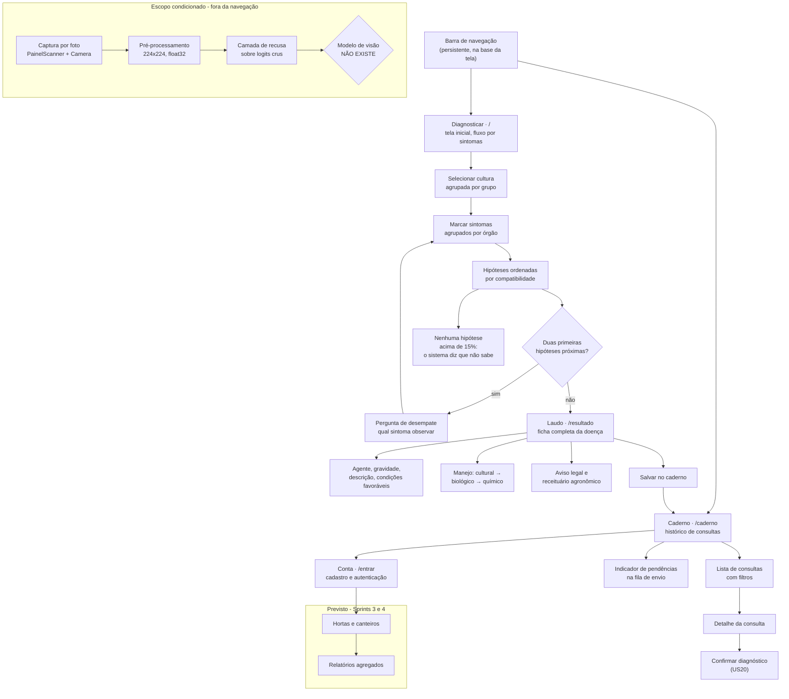
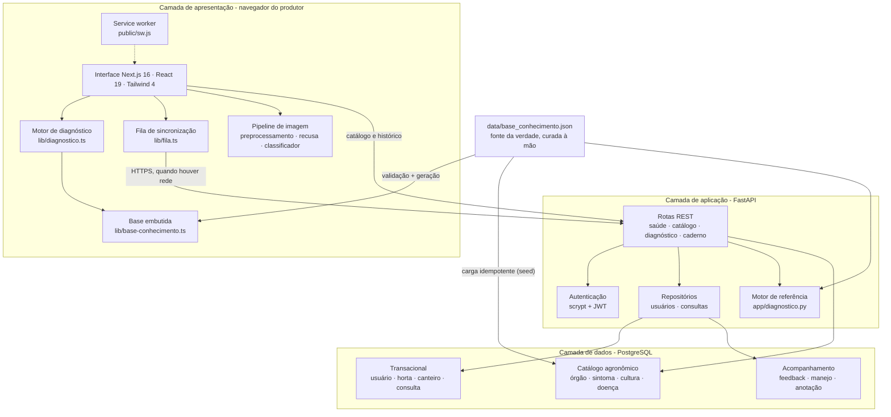
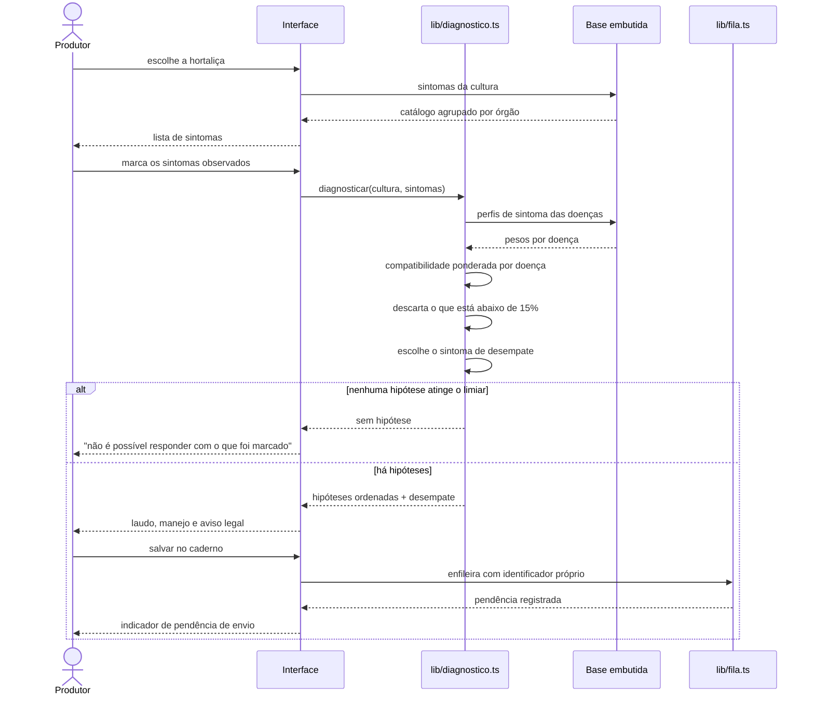
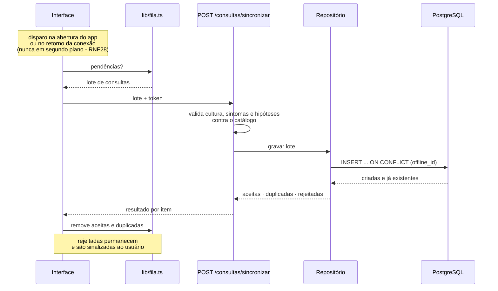
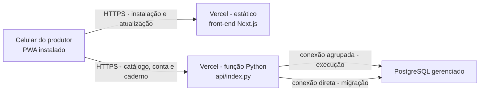

# Artefato 3 - Gestão do Produto

## Arquitetura da informação · Design arquitetural · Testes de integração · Protótipo de baixo nível · Storyboard

| Campo | Informação |
| --- | --- |
| Projeto | AgroScan - PWA para diagnóstico de doenças em hortaliças |
| Disciplina | Projeto Integrador II |
| Turma | B |
| Instituição | CEUB - Centro Universitário de Brasília |
| Professora responsável | Adriana Falcomer Pontes |
| IDProjeto | 20260286 |
| Equipe | Gabriela Pedersoli Caldana (22404253) · Thaís Regina Dias da Mota (22403754) |
| Entrega | 14/09/2026 |
| Sprint | Sprint 1 - Especificação e gestão |
| Repositório de código | https://github.com/gabicaldana/AgroScan2 |

---

# 1. Arquitetura da informação

## 1.1 Mapa de navegação

O aplicativo tem **dois destinos permanentes**, ancorados numa barra inferior -
a zona alcançável pelo polegar com o celular numa única mão, que é como o
produtor o usa no canteiro. As demais telas são alcançadas a partir delas.

A captura por foto **não integra a navegação**: o diagnóstico por imagem é
escopo condicionado e o modelo de visão não existe, de modo que uma aba
permanente para ele só teria um aviso de indisponibilidade a oferecer. A decisão
está registrada no [ADR 0008](decisoes/adr-0008-hierarquia-de-entrada.md), e o
código do caminho de imagem permanece no repositório, verificado por 29 testes.



## 1.2 Inventário de telas

| Tela | Rota | Componente | Estado |
| --- | --- | --- | --- |
| Diagnosticar planta | `/` | `PainelSintomas` + `SeletorCultura` | ✅ implementada - **tela inicial** |
| Laudo da doença | `/resultado` | `Laudo` + `BarraGravidade` + `AvisoLegal` | ✅ implementada |
| Caderno de campo | `/caderno` | `PainelCaderno` | ✅ implementada |
| Sua conta | `/entrar` | `PainelEntrar` | ✅ implementada |
| Hortas e canteiros | `/hortas` | - | ⬜ Sprint 3 |
| Relatórios | `/relatorios` | - | ⬜ Sprint 4 |
| Captura por foto | *(sem rota)* | `PainelScanner` + `Camera` | 🟡 escopo condicionado - fora da navegação |

A rota `/sintomas`, que antes abrigava o diagnóstico, foi promovida à raiz e
responde hoje por **redirecionamento permanente** para `/`. O redirecionamento
existe porque a rota antiga está em três lugares fora do alcance da equipe: o
atalho de quem já instalou o PWA, o cache do service worker de quem ainda não
atualizou e qualquer link já compartilhado.

Componentes transversais: `CabecalhoApp`, `BarraInferior`, `IndicadorRede`,
`BarraCompatibilidade`, `EstadoVazio`, `Botao`,
`RegistroServiceWorker`.

## 1.3 Princípios que organizam a informação

| Princípio | Aplicação |
| --- | --- |
| **Agrupar pelo que o usuário enxerga, não pelo que o sistema sabe** | Os sintomas são agrupados pelo **órgão da planta** onde aparecem - folha, caule, raiz/bulbo, fruto, planta inteira - porque é assim que o produtor olha para a planta. Não são agrupados por agente causal, que é uma categoria do domínio técnico |
| **Reduzir o espaço de busca antes de pedir a observação** | A cultura é escolhida primeiro. Isso restringe o catálogo de sintomas ao que de fato ocorre naquela hortaliça, e encurta a lista que o produtor precisa percorrer sob sol |
| **Lista plana não serve em celular sob sol** | As 24 culturas são agrupadas nos cinco grupos da classificação da Embrapa por parte comestível: fruto, folha, flor, haste, raiz/tubérculo/bulbo |
| **Incerteza é informação, e fica visível** | A lista de hipóteses é ordenada e cada item traz o grau de compatibilidade. Quando nada atinge o limiar, o resultado é uma declaração de desconhecimento, e não a hipótese menos improvável |
| **Profundidade máxima de três toques até o laudo** | Cultura → sintomas → laudo |

## 1.4 Correção aplicada na hierarquia de entrada

**Situação anterior.** A tela inicial era "Escanear planta", com a captura por
foto como primeira ação oferecida, e o fluxo por sintomas aparecia como
alternativa secundária, sob um separador "ou". A barra de navegação tinha três
abas: Escanear, Sintomas e Caderno.

**Problema.** Essa hierarquia invertia a do produto. O modelo de visão
computacional **não existe** - é escopo condicionado à auditoria de um acervo de
imagens ainda não verificado. O fluxo por sintomas é o produto completo e
funcional. A arquitetura da informação oferecia primeiro o caminho que termina
num aviso de indisponibilidade, e o aviso só aparecia **depois** de a pessoa ter
fotografado. Para um usuário decidindo sob sol e com pressa, a primeira
tentativa não resolvia e o trabalho de enquadrar e fotografar era perdido.

**Correção aplicada.**

| Antes | Depois |
| --- | --- |
| Aba 1: Escanear (`/`) - câmera | Aba 1: **Diagnosticar** (`/`) - fluxo por sintomas |
| Aba 2: Sintomas (`/sintomas`) | *(removida - `/sintomas` redireciona para `/`)* |
| Aba 3: Caderno (`/caderno`) | Aba 2: Caderno (`/caderno`) |

A captura por foto saiu inteiramente da navegação, e não apenas mudou de
posição: numa barra de três abas, um terço do espaço de navegação permanente -
a zona mais valiosa da tela - ficaria reservado a uma funcionalidade cujo único
desfecho possível é um aviso de indisponibilidade.

**O código do caminho de imagem permanece no repositório**, coberto por 29
testes que seguem executando na integração contínua. O que é difícil ali não é
a tela: é o pré-processamento com paridade de pixel e a camada de recusa, ambos
prontos e verificados. Quando houver modelo, basta criar a rota e apontar para o
componente.

Efeitos colaterais tratados: redirecionamento permanente de `/sintomas` para
`/`, e o service worker subiu de `v4` para `v5` - sem trocar o nome do cache,
quem já tem o aplicativo instalado continuaria abrindo a tela de câmera offline
indefinidamente.

> Decisão aprovada e implementada na Sprint 1. Ver
> [ADR 0008](decisoes/adr-0008-hierarquia-de-entrada.md).

---

# 2. Design arquitetural

## 2.1 Princípio organizador

> **O cliente é autoridade sobre a resposta. O servidor é autoridade sobre o registro.**

Duas restrições do contexto de uso produzem esse princípio:

1. **A horta tem sinal ruim ou nenhum.** Se o diagnóstico depende de uma chamada de rede, o sistema falha exatamente onde precisa funcionar. O cálculo roda no navegador, sobre a base embutida no pacote da aplicação. Não é economia de servidor - é requisito funcional (RNF01).
2. **Um sistema que sempre responde, mente.** Um diagnóstico devolvido com ares de certeza sobre um quadro incompleto é pior que nenhum, porque induz à aplicação errada. O motor apresenta **compatibilidade**, não probabilidade, e declara desconhecimento quando nenhuma hipótese atinge o limiar.

O servidor guarda o que precisa ser compartilhado entre pessoas e dispositivos,
e faz as agregações que só o SQL faz bem.

## 2.2 Visão em camadas



## 2.3 Responsabilidades por camada

### Camada de apresentação - PWA

| Módulo | Responsabilidade |
| --- | --- |
| `lib/diagnostico.ts` | Cálculo do índice de compatibilidade e da pergunta de desempate. Porte do motor de referência, com paridade exata verificada por fixtures |
| `lib/base-conhecimento.ts` | Catálogo agronômico embutido no pacote. **Gerado** a partir do JSON curado; não é editado à mão |
| `lib/fila.ts` | Fila local de consultas registradas sem conexão, com identificador próprio por consulta |
| `lib/caderno.ts` | Composição da consulta a enviar, incluindo a versão do catálogo usada |
| `lib/api.ts` | Cliente HTTP da API |
| `lib/sessao.ts` | Persistência da sessão autenticada no dispositivo |
| `lib/preprocessamento.ts` | Redimensionamento e normalização da imagem, com paridade de pixel contra a referência em Python |
| `lib/recusa.ts` | Pontuações de fora-da-distribuição sobre os logits crus: MSP, energia livre e margem |
| `lib/classificador.ts` | Interface do modelo de visão. Hoje devolve `null` - é um contrato, não um runtime |
| `public/sw.js` | Service worker escrito à mão: cacheia a casca da aplicação e os arquivos referenciados pelo HTML |

### Camada de aplicação - FastAPI

| Rota | Método | Autenticação | Requisito |
| --- | --- | --- | --- |
| `/api/v1/saude` | GET | não | - |
| `/api/v1/catalogo` | GET | não | RF33 |
| `/api/v1/catalogo/versao` | GET | não | RF34, RF35 |
| `/api/v1/culturas` | GET | não | RF01 |
| `/api/v1/culturas/{id}/sintomas` | GET | não | RF02 |
| `/api/v1/doencas/{id}` | GET | não | RF07 |
| `/api/v1/diagnosticos` | POST | **não** | RF04, RF14 |
| `/api/v1/autenticacao/registro` | POST | não | RF12 |
| `/api/v1/autenticacao/token` | POST | não | RF13 |
| `/api/v1/autenticacao/eu` | GET | sim | RF13 |
| `/api/v1/autenticacao/eu` | DELETE | sim | RF15, RNF17 |
| `/api/v1/consultas` | POST | sim | RF16 |
| `/api/v1/consultas/sincronizar` | POST | sim | RF17, RF18 |
| `/api/v1/consultas` | GET | sim | RF19 |
| `/api/v1/consultas/{id}` | GET | sim | RF19 |
| `/api/v1/consultas/{id}/feedback` | POST | sim | RF20 |

O diagnóstico **não exige autenticação**, por decisão de produto (RF14): o
produtor precisa poder experimentar o sistema antes de criar conta. A exigência
de conta começa no caderno de campo, onde há dado pessoal a proteger.

### Camada de dados - PostgreSQL

19 tabelas, em três grupos:

| Grupo | Tabelas | Origem dos dados |
| --- | --- | --- |
| Catálogo agronômico | `versao_catalogo`, `orgao`, `cultura`, `sintoma`, `doenca`, `doenca_sintoma`, `tratamento`, `ingrediente_ativo` | **Carregado** do JSON curado por `app/seed.py`, em `UPSERT` idempotente. Ninguém digita um `INSERT` de doença |
| Transacional | `usuario`, `horta`, `membro_horta`, `canteiro`, `consulta`, `consulta_sintoma`, `consulta_hipotese`, `consulta_foto` | Escrito pela aplicação |
| Acompanhamento | `feedback`, `manejo`, `anotacao` | Escrito pela aplicação |

O DDL está em `migracoes/`, numerado e com par de reversão. Modelo completo em
`docs/modelo-de-dados.md` no repositório de código.

## 2.4 Fluxo 1 - diagnóstico sem conexão

Este é o fluxo que define a arquitetura: **nenhuma seta cruza a fronteira da
rede.**



## 2.5 Fluxo 2 - sincronização da fila

Reenviar a fila é o **caso normal**, não a exceção: o aplicativo não sabe se um
envio anterior chegou antes de a conexão cair. A garantia de não duplicar mora
no banco, e não apenas no código do cliente.



## 2.6 Implantação



**Duas strings de conexão, e a diferença importa.** `DATABASE_URL` é a agrupada
(*pooled*), usada em tempo de execução; `DATABASE_URL_DIRETA` é a não agrupada,
usada para migração, porque DDL não sobrevive a *transaction pooling*. A
separação também mitiga o risco R05, de esgotamento de conexões no plano
gratuito.

## 2.7 Como a base curada chega aos três lugares

O mesmo conteúdo agronômico alimenta o navegador, o servidor e o banco. Ele é
escrito **uma vez**, e derivado por geração - nunca copiado à mão.

```
data/base_conhecimento.json          fonte da verdade, curada à mão
        │
        ├─ python -m app.validacao ──> recusa a base incoerente antes de qualquer uso
        │
        ├─ python -m app.fixtures ───> tests/fixtures/casos_diagnostico.json
        │                                    │
        │                                    ├──> teste Python: o motor ainda
        │                                    │    produz exatamente este arquivo
        │                                    ├──> teste HTTP: a API reproduz
        │                                    │    cada caso, campo a campo
        │                                    └──> teste TS: o porte reproduz
        │                                         cada campo de cada caso
        │
        ├─ npm run base ────────────> web/lib/base-conhecimento.ts (embutido no pacote)
        │
        └─ python -m app.seed ──────> PostgreSQL (UPSERT idempotente)
```

Quatro artefatos são **gerados e versionados**: as fixtures do motor, as
fixtures de pixel e os dois módulos TypeScript. Cada um tem teste de frescor, e
a integração contínua falha se algum divergir de sua fonte (RNF20). Nenhum deles
pode envelhecer em silêncio.

## 2.8 Decisões arquiteturais

Cada decisão está registrada como ADR em `docs/decisoes/`:

| ADR | Decisão |
| --- | --- |
| 0001 | Diagnóstico calculado no cliente |
| 0002 | Índice de similaridade ponderado, e não classificador probabilístico |
| 0003 | Base de conhecimento como fonte única, derivada por geração |
| 0004 | Motor duplicado com paridade verificada por fixtures |
| 0005 | Contrato de pré-processamento definido pelo projeto |
| 0006 | Recusa calculada sobre logits crus |
| 0007 | PWA em vez de aplicativo nativo |
| 0008 | Sintomas como tela inicial, câmera fora da navegação |
| 0009 | Idempotência da sincronização garantida no banco |

---

# 3. Testes de integração

## 3.1 Estratégia

O sistema tem uma característica que orienta toda a estratégia de teste: **a
mesma regra de diagnóstico existe três vezes** - no motor puro em Python, na API
que o serve por HTTP, e no porte em TypeScript que roda no navegador. Duas
implementações da mesma regra divergem sozinhas; basta um arredondamento
diferente. Três, mais ainda.

O contrato entre elas é um arquivo de fixtures gerado pelo Python e versionado.
Se as três concordam caso a caso, não existe caminho pelo qual o usuário receba
um diagnóstico diferente do que a base curada determina.

A comparação é por **igualdade exata**, sem tolerância. Comparar com tolerância
deixaria passar justamente as divergências reais que o teste existe para pegar.

## 3.2 Inventário executado

Execução verificada em 12/09/2026, sobre o commit `068b6d9`:

| Suíte | Comando | Testes | Resultado |
| --- | --- | --- | --- |
| Motor de referência | `python -m unittest tests.test_diagnostico` | 28 | ✅ |
| Caderno de campo e autorização | `python -m unittest tests.test_caderno` | 14 | ✅ |
| Pré-processamento de imagem | `python -m unittest tests.test_preprocessamento` | 13 | ✅ |
| Segurança - senha e token | `python -m unittest tests.test_seguranca` | 11 | ✅ |
| API HTTP e paridade | `python -m unittest tests.test_api` | 8 | ✅ |
| **Subtotal Python** | `python -m unittest discover -s tests -t .` | **74** | **✅ 0 falhas** |
| Porte TypeScript | `npm test` *(14 suítes)* | **102** | **✅ 0 falhas** |
| **Total** | | **176** | **✅** |

Validação da base de conhecimento:

```
$ python -m app.validacao
Base valida - versao 2026.09.03
  3 hortalicas, 13 doencas, 26 sintomas no catalogo

  2 aviso(s) de curadoria incompleta:
    - cultura batata: 2 doenca(s). Abaixo de 3 o motor nunca tem segunda
      hipotese, e a pergunta de desempate nao funciona nesta cultura
    - cultura pimentao: 1 doenca(s). [...]
```

## 3.3 Casos de teste de integração

Integração aqui significa: o teste atravessa mais de uma camada. Os casos abaixo
exercitam a rota HTTP, a validação de entrada, o repositório e a regra de
negócio em conjunto.

### 3.3.1 Paridade entre implementações

| ID | Objetivo | Camadas | Implementação | Resultado |
| --- | --- | --- | --- | --- |
| TI01 | A resposta de `POST /diagnosticos` reproduz cada caso das fixtures, campo a campo | HTTP → motor | `test_cada_caso_das_fixtures_bate_com_a_resposta_http` | ✅ |
| TI02 | A pergunta de desempate servida por HTTP é idêntica à do motor de referência | HTTP → motor | `test_a_pergunta_de_desempate_tambem_bate` | ✅ |
| TI03 | O porte em TypeScript reproduz cada campo de cada caso das fixtures | Cliente → base embutida | `lib/diagnostico.test.ts` | ✅ |
| TI04 | O catálogo de sintomas por cultura servido pela API bate com as fixtures | HTTP → catálogo | `test_culturas_batem_com_as_fixtures` | ✅ |
| TI05 | A ficha completa da doença servida pela API bate com a fixture | HTTP → catálogo | `test_ficha_de_doenca_bate_com_a_fixture` | ✅ |
| TI06 | O tensor produzido no navegador é idêntico ao da referência, por digest SHA-256 | Cliente ↔ Python | `lib/preprocessamento.test.ts` + `test_preprocessamento` | ✅ |

### 3.3.2 Sincronização offline e idempotência

| ID | Objetivo | Requisito | Implementação | Resultado |
| --- | --- | --- | --- | --- |
| TI07 | Uma consulta nova responde como criada | RF16 | `test_consulta_nova_responde_criada` | ✅ |
| TI08 | O reenvio da mesma consulta **não** cria registro novo | RF18, RN11 | `test_reenvio_da_mesma_consulta_nao_duplica` | ✅ |
| TI09 | A sincronização em lote separa aceitas, duplicadas e rejeitadas | RF17 | `test_sincronizar_separa_aceitas_duplicadas_e_rejeitadas` | ✅ |
| TI10 | Um lote vazio responde sem erro | RF17 | `test_lote_vazio_responde_sem_erro` | ✅ |
| TI11 | A fila local preserva a versão do catálogo usada no diagnóstico | RF35, RN10 | `lib/fila.test.ts` | ✅ |

### 3.3.3 Autorização e isolamento entre usuários

| ID | Objetivo | Requisito | Implementação | Resultado |
| --- | --- | --- | --- | --- |
| TI12 | Todas as rotas do caderno exigem autenticação | RNF13 | `test_rotas_do_caderno_exigem_autenticacao` | ✅ |
| TI13 | O diagnóstico **não** exige autenticação | RF14 | `test_o_diagnostico_NAO_exige_autenticacao` | ✅ |
| TI14 | Uma consulta de outra pessoa não é visível | RNF15 | `test_consulta_de_outra_pessoa_nao_e_visivel` | ✅ |
| TI15 | Feedback em consulta de outra pessoa responde 404, e não 403 | RNF15 | `test_feedback_em_consulta_de_outra_pessoa_da_404` | ✅ |

> O retorno de **404 em vez de 403** é deliberado: um 403 confirmaria a
> existência do registro de outra pessoa, o que é vazamento de informação.

### 3.3.4 Validação de entrada contra o catálogo

| ID | Objetivo | Implementação | Resultado |
| --- | --- | --- | --- |
| TI16 | Cultura desconhecida é recusada **antes** de tocar o banco | `test_cultura_desconhecida_e_recusada_antes_do_banco` | ✅ |
| TI17 | Sintoma desconhecido é recusado | `test_sintoma_desconhecido_e_recusado` | ✅ |
| TI18 | Doença desconhecida na hipótese é recusada | `test_doenca_desconhecida_na_hipotese_e_recusada` | ✅ |
| TI19 | Coordenada pela metade - só latitude ou só longitude - é recusada | `test_coordenada_pela_metade_e_recusada` | ✅ |
| TI20 | Cultura inexistente responde 404, e não lista vazia | `test_cultura_desconhecida_da_404_e_nao_lista_vazia` | ✅ |
| TI21 | Feedback marcado como confirmado apontando outra doença é incoerente | `test_confirmado_com_outra_doenca_e_incoerente` | ✅ |
| TI22 | Feedback não confirmado **com** a doença real é aceito | `test_nao_confirmado_com_a_doenca_real_e_aceito` | ✅ |

### 3.3.5 Resiliência e observabilidade

| ID | Objetivo | Implementação | Resultado |
| --- | --- | --- | --- |
| TI23 | `/saude` responde mesmo sem banco configurado | `test_saude_responde_sem_banco_configurado` | ✅ |
| TI24 | `/saude` relata a falha de conexão em vez de quebrar | `test_saude_relata_a_falha_de_conexao_em_vez_de_quebrar` | ✅ |
| TI25 | A versão do catálogo traz o checksum do arquivo de origem | `test_versao_do_catalogo_traz_checksum_do_arquivo` | ✅ |

### 3.3.6 Segurança

| ID | Objetivo | Requisito | Resultado |
| --- | --- | --- | --- |
| TI26 | A mesma senha gera hashes diferentes - o sal é por senha | RNF12 | ✅ |
| TI27 | A senha não aparece no hash | RNF12 | ✅ |
| TI28 | O hash carrega os próprios parâmetros de derivação | RNF12 | ✅ |
| TI29 | Hash corrompido nega o acesso em vez de levantar exceção | RNF12 | ✅ |
| TI30 | Token assinado com outro segredo é recusado | RNF13 | ✅ |
| TI31 | Token expirado é recusado com mensagem própria | RNF13 | ✅ |
| TI32 | Sem segredo configurado, a criação de token falha | RNF13 | ✅ |

## 3.4 Integração contínua

O workflow em `.github/workflows/ci.yml` executa, em ordem:

1. `python -m app.validacao` - recusa base incoerente
2. `python -m app.fixtures` e `python -m app.preprocessamento` - regeram os artefatos
3. `pip install -r requirements.txt`
4. `python -m unittest discover -s tests -t . -v`
5. `npm ci` e `npm run base`
6. `npm test`
7. `npm run lint` e `npm run build`
8. **Verificação final:** `git status --porcelain` tem que estar vazio

O passo 8 é o que dá força à promessa: depois de regerar tudo, se um arquivo
gerado mudou, alguém editou uma fonte e esqueceu de regerar - e o commit teria
entrado com base e artefato divergentes.

### 3.4.1 Defeito identificado nesta sprint

O cliente HTTP exigido por `fastapi.testclient` **não está declarado** em
`requirements.txt`. Os módulos `tests/test_api.py` e `tests/test_caderno.py`
protegem-se com `except ImportError`, mas a ausência da dependência levanta
`RuntimeError`, que a proteção não captura. Consequência: **22 testes de
integração da API ou falham a execução, ou se pulam silenciosamente**,
dependendo de como as versões transitivas são resolvidas.

Reprodução local, antes da correção:

```
RuntimeError: The starlette.testclient module requires the httpx2 package
Ran 54 tests ... FAILED (errors=2)
```

Depois de instalar a dependência ausente:

```
Ran 74 tests in 7.296s
OK
```

Registrado como risco **R07** no Artefato 2. Correção prevista para a Sprint 2:
declarar a dependência de teste e garantir que a integração contínua **execute**
- e não pule - os testes da API.

## 3.5 Lacunas conhecidas de teste

Honestidade sobre cobertura vale mais do que um número alto:

| Lacuna | Efeito | Plano |
| --- | --- | --- |
| Os testes da API usam cliente de teste em memória, **sem banco real** | Restrições do banco - inclusive a unicidade de `offline_id`, que é a garantia de idempotência - não são exercitadas pelos testes automatizados | Teste de integração com PostgreSQL efêmero na Sprint 3 |
| Não há teste ponta a ponta de navegador | O fluxo offline é verificado manualmente em dispositivo real | Testes ponta a ponta do fluxo offline na Sprint 6 |
| RNF02 (diagnóstico em menos de 100 ms) e RNF03 (API em 3 s no p95) não são medidos automaticamente | Os requisitos de desempenho não têm evidência automatizada | Medição na Sprint 6 |
| Acessibilidade (RNF05-RNF08) verificada por inspeção | Sem verificação automatizada de contraste e alvo de toque | Auditoria de acessibilidade na Sprint 6 |
| Relatórios e hortas ainda não existem | Sem cobertura | Testes escritos junto das features, Sprints 3 e 4 |

---

# 4. Protótipo de baixo nível

Wireframes em baixa fidelidade das telas implementadas. As medidas anotadas são
as do sistema de design: toque de 56px, corpo de 18px, bordas sólidas de 2px,
fundo branco, sem sombras.

## 4.1 Tela inicial: seleção de cultura e sintomas - `/`

```
┌──────────────────────────────┐
│ AgroScan            ◉ offline│  ← IndicadorRede (RF36)
├──────────────────────────────┤
│                              │
│ Diagnosticar planta          │  22px, negrito
│ Escolha a hortaliça e marque │  18px, texto suave
│ o que você observa.          │
│                              │
│ ┌──────────────────────────┐ │
│ │ Hortaliça                │ │
│ │ ┌──────────────────────┐ │ │
│ │ │ Tomate            ▼  │ │ │  ← 56px de altura
│ │ └──────────────────────┘ │ │
│ │  Fruto · Solanaceae      │ │
│ └──────────────────────────┘ │
│                              │
│ FOLHA                        │  agrupamento por órgão (RF02)
│ ┌──────────────────────────┐ │
│ │ ☑ Manchas escuras com    │ │  ← 56px, alvo de toque
│ │   anéis concêntricos     │ │
│ ├──────────────────────────┤ │
│ │ ☑ Amarelecimento das     │ │
│ │   folhas mais velhas     │ │
│ ├──────────────────────────┤ │
│ │ ☐ Mofo branco na face    │ │
│ │   inferior               │ │
│ └──────────────────────────┘ │
│                              │
│ FRUTO                        │
│ ┌──────────────────────────┐ │
│ │ ☐ Lesão escura deprimida │ │
│ └──────────────────────────┘ │
│                              │
│ ┌──────────────────────────┐ │
│ │   Ver hipóteses (2)      │ │  ← contador de marcados
│ └──────────────────────────┘ │
├──────────────────────────────┤
│      ☰              📓       │  ← BarraInferior, 56px
│ Diagnosticar      Caderno    │     duas abas (ADR 0008)
└──────────────────────────────┘
```

## 4.2 Hipóteses ordenadas e pergunta de desempate

```
┌──────────────────────────────┐
│ ← Hipóteses                  │
├──────────────────────────────┤
│ 2 sintomas marcados          │
│                              │
│ ┌──────────────────────────┐ │
│ │ Pinta-preta         72%  │ │
│ │ ████████████░░░░░        │ │  ← BarraCompatibilidade
│ │ Alternaria solani        │ │     (nunca só cor - RNF08)
│ │ Gravidade: Alta ████░    │ │
│ └──────────────────────────┘ │
│ ┌──────────────────────────┐ │
│ │ Mancha-alvo         65%  │ │
│ │ ██████████░░░░░░░        │ │
│ │ Corynespora cassiicola   │ │
│ │ Gravidade: Alta ████░    │ │
│ └──────────────────────────┘ │
│                              │
│ ┌─ ? ──────────────────────┐ │  ← pergunta de desempate (RF06)
│ │ Para separar as duas,    │ │
│ │ verifique:               │ │
│ │                          │ │
│ │ "Lesão concêntrica no    │ │
│ │  fruto"                  │ │
│ │                          │ │
│ │ Se houver, afasta        │ │
│ │ Mancha-alvo.             │ │
│ │                          │ │
│ │ [ Encontrei ] [ Não há ] │ │
│ └──────────────────────────┘ │
└──────────────────────────────┘
```

**Estado de desconhecimento** (RF05, RN03) - o que aparece quando nenhuma
hipótese atinge 15%:

```
┌──────────────────────────────┐
│ ┌──────────────────────────┐ │
│ │  Não é possível indicar  │ │
│ │  uma doença com os       │ │
│ │  sintomas marcados.      │ │
│ │                          │ │
│ │  Marque outros sintomas  │ │
│ │  ou procure assistência  │ │
│ │  técnica.                │ │
│ └──────────────────────────┘ │
└──────────────────────────────┘
```

## 4.3 Laudo da doença - `/resultado`

```
┌──────────────────────────────┐
│ ← Pinta-preta                │
├──────────────────────────────┤
│ Alternaria solani  ·  Fungo  │
│                              │
│ Gravidade                    │
│ ████████████████░░░░  Alta   │  ← barra + escala + rótulo
│                              │
│ O QUE É                      │
│ Manchas escuras com anéis    │
│ concêntricos, começando      │
│ pelas folhas mais velhas...  │
│                              │
│ CONDIÇÕES FAVORÁVEIS         │
│ • 24 a 29 °C                 │
│ • Molhamento foliar > 6 h    │
│ • Alternância de chuva e sol │
│                              │
│ MANEJO                       │  ← ordem obrigatória (RF08, RN06)
│ ┌─ 1. CULTURAL ────────────┐ │
│ │ • Rotação com não-        │ │
│ │   solanáceas por 2 anos   │ │
│ │ • Eliminar restos         │ │
│ └──────────────────────────┘ │
│ ┌─ 2. BIOLÓGICO ───────────┐ │
│ │ • Bacillus subtilis       │ │
│ └──────────────────────────┘ │
│ ┌─ 3. QUÍMICO ─────────────┐ │
│ │ • Mancozebe               │ │
│ │ • Azoxistrobina           │ │
│ └──────────────────────────┘ │
│                              │
│ ┌─ ⚠ AVISO ────────────────┐ │  ← em todo laudo (RF09, RN09)
│ │ Sistema educativo e de   │ │
│ │ apoio à decisão. Não     │ │
│ │ substitui engenheiro     │ │
│ │ agrônomo. A aquisição e  │ │
│ │ aplicação de defensivos  │ │
│ │ exigem receituário       │ │
│ │ agronômico. Confira o    │ │
│ │ registro no AGROFIT/MAPA.│ │
│ └──────────────────────────┘ │
│                              │
│ ┌──────────────────────────┐ │
│ │  Salvar no caderno       │ │
│ └──────────────────────────┘ │
└──────────────────────────────┘
```

## 4.4 Caderno de campo - `/caderno`

```
┌──────────────────────────────┐
│ AgroScan            ◉ offline│
├──────────────────────────────┤
│ Caderno de campo             │
│                              │
│ ┌─ ↑ 2 pendentes ──────────┐ │  ← fila de envio (RF17)
│ │ Serão enviadas quando    │ │
│ │ houver rede.             │ │
│ └──────────────────────────┘ │
│                              │
│ [Período ▼] [Cultura ▼]      │  ← filtros (RF19)
│                              │
│ ┌──────────────────────────┐ │
│ │ 12/09  Tomate       ↑    │ │  ← ↑ = pendente de envio
│ │ Pinta-preta · 72%        │ │
│ ├──────────────────────────┤ │
│ │ 09/09  Batata       ✓    │ │
│ │ Requeima · 81%           │ │
│ │ Confirmado               │ │  ← feedback (RF20)
│ ├──────────────────────────┤ │
│ │ 03/09  Tomate       ✓    │ │
│ │ Sem hipótese             │ │
│ └──────────────────────────┘ │
├──────────────────────────────┤
│      ☰              📓       │
│ Diagnosticar      Caderno    │
└──────────────────────────────┘
```

**Estado vazio**, para quem abre o caderno pela primeira vez:

```
┌──────────────────────────────┐
│                              │
│         ┌─────────┐          │
│         │   📓    │          │
│         └─────────┘          │
│                              │
│  Nenhuma consulta ainda.     │
│                              │
│  Faça um diagnóstico por     │
│  sintomas e ele aparece      │
│  aqui - inclusive sem sinal. │
│                              │
│ ┌──────────────────────────┐ │
│ │  Marcar sintomas         │ │  ← leva à tela inicial
│ └──────────────────────────┘ │
└──────────────────────────────┘
```

## 4.5 Captura por foto - sem rota, escopo condicionado

Esta tela **não está na navegação** e nenhuma rota aponta para ela. O
componente permanece no repositório porque o caminho ao redor do modelo está
pronto e verificado; falta o modelo de visão. Ver
[ADR 0008](decisoes/adr-0008-hierarquia-de-entrada.md).

O wireframe fica registrado como especificação do que será religado quando
houver modelo:

```
┌──────────────────────────────┐
│ Escanear planta              │
├──────────────────────────────┤
│ ┌──────────────────────────┐ │
│ │ Hortaliça                │ │
│ │ ┌──────────────────────┐ │ │
│ │ │ Tomate            ▼  │ │ │
│ │ └──────────────────────┘ │ │
│ └──────────────────────────┘ │
│                              │
│ ┌─ ⚠ ──────────────────────┐ │  ← RF11: declarar, não chutar
│ │ A identificação          │ │
│ │ automática por foto      │ │
│ │ ainda não está           │ │
│ │ disponível.              │ │
│ │                          │ │
│ │ A foto pode ser anexada  │ │
│ │ como registro visual.    │ │
│ │                          │ │
│ │ Para o diagnóstico, use  │ │
│ │ o fluxo por sintomas.    │ │
│ └──────────────────────────┘ │
│                              │
│ ┌──────────────────────────┐ │
│ │  Diagnosticar por        │ │  ← caminho que funciona
│ │  sintomas                │ │
│ └──────────────────────────┘ │
│ ┌──────────────────────────┐ │
│ │  Abrir câmera            │ │
│ └──────────────────────────┘ │
└──────────────────────────────┘
```

---

# 5. Storyboard

**Cenário.** Terça-feira, 9h40. Dona Marisa cultiva tomate, alface e couve num
terreno de meio hectare na periferia de Brasília. Vende na feira de sábado. Não
tem agrônomo - a última visita técnica foi há oito meses. O sinal de celular na
parte baixa do terreno não existe.

---

### Quadro 1 - O problema aparece

```
┌────────────────────────────────────────┐
│   ☀️                                    │
│                                        │
│      🌿 planta de tomate                │
│      folhas baixas com manchas          │
│      escuras e anéis                    │
│                                        │
│   👩‍🌾  Dona Marisa agachada,             │
│       olhando a folha                   │
│                                        │
└────────────────────────────────────────┘
```

> Ela vê manchas escuras nas folhas de baixo de várias plantas. Já viu parecido
> antes, e da última vez pulverizou o que tinha no galpão. Não funcionou, e ela
> não sabe se era a doença errada ou o produto errado.

---

### Quadro 2 - Abre o aplicativo, sem sinal

```
┌────────────────────────────────────────┐
│  📱  ┌──────────────────────┐           │
│      │ AgroScan    ◉ offline│           │
│      │                      │           │
│      │ Diagnosticar planta  │           │
│      │                      │           │
│      │ Hortaliça: Tomate ▼  │           │
│      └──────────────────────┘           │
│                                        │
│   Sem barra de sinal no canto           │
│   do celular - e o app abre.             │
└────────────────────────────────────────┘
```

> O aplicativo está instalado na tela inicial, como qualquer outro. Abre sem
> rede. O indicador mostra "offline", e isso não impede nada: o diagnóstico é
> calculado no próprio aparelho.

---

### Quadro 3 - Marca o que vê

```
┌────────────────────────────────────────┐
│      ┌──────────────────────┐           │
│      │ FOLHA                │           │
│      │ ☑ Manchas escuras    │           │
│      │   com anéis          │           │
│      │ ☑ Amarelecimento nas │           │
│      │   folhas velhas      │           │
│      │ ☐ Mofo branco        │           │
│      │                      │           │
│      │ [ Ver hipóteses (2) ]│           │
│      └──────────────────────┘           │
│                                        │
│   👆 dedo com luva de jardinagem        │
└────────────────────────────────────────┘
```

> Os sintomas vêm separados por parte da planta - folha, caule, fruto - que é
> como ela olha para o pé de tomate. Marca dois. Os botões são grandes o
> suficiente para acertar de luva.

---

### Quadro 4 - Duas hipóteses, e a dúvida declarada

```
┌────────────────────────────────────────┐
│      ┌──────────────────────┐           │
│      │ Pinta-preta     72%  │           │
│      │ ███████████░░░       │           │
│      │ Mancha-alvo     65%  │           │
│      │ █████████░░░░░       │           │
│      │                      │           │
│      │ ? Para separar,      │           │
│      │   verifique:         │           │
│      │   "Lesão no fruto"   │           │
│      └──────────────────────┘           │
└────────────────────────────────────────┘
```

> O sistema não escolhe por ela. Mostra as duas, com o grau de compatibilidade
> de cada uma, e diz exatamente o que ir olhar: se houver lesão concêntrica no
> fruto, afasta a mancha-alvo.
>
> **É o passo que um classificador de foto não daria.** Ele devolveria um nome e
> uma porcentagem.

---

### Quadro 5 - Vai olhar o fruto

```
┌────────────────────────────────────────┐
│                                        │
│      🍅  fruto verde, sem lesão         │
│                                        │
│   👩‍🌾 virando o fruto na mão              │
│                                        │
│      ┌──────────────────────┐           │
│      │ [ Encontrei ][ Não há]│          │
│      └──────────────────────┘           │
└────────────────────────────────────────┘
```

> Ela vira alguns frutos. Nenhuma lesão. Toca em "Não há" - e a pinta-preta
> sobe, porque a observação ausente também é informação.

---

### Quadro 6 - O laudo, na ordem certa

```
┌────────────────────────────────────────┐
│      ┌──────────────────────┐           │
│      │ Pinta-preta          │           │
│      │ Gravidade ████░ Alta │           │
│      │                      │           │
│      │ MANEJO               │           │
│      │ 1. CULTURAL          │           │
│      │   Rotação 2 anos     │           │
│      │   Eliminar restos    │           │
│      │ 2. BIOLÓGICO         │           │
│      │   Bacillus subtilis  │           │
│      │ 3. QUÍMICO           │           │
│      │   Mancozebe          │           │
│      │                      │           │
│      │ ⚠ Exige receituário  │           │
│      │   agronômico         │           │
│      └──────────────────────┘           │
└────────────────────────────────────────┘
```

> O manejo vem em três degraus, nesta ordem. A primeira coisa oferecida não é um
> produto para comprar - é eliminar os restos culturais e planejar a rotação. O
> defensivo aparece por último, com o aviso de que exige receituário
> agronômico.
>
> **É aqui que o sistema ataca a pulverização por precaução:** não escondendo o
> defensivo, mas colocando-o depois do que custa menos e resolve mais.

---

### Quadro 7 - Fica registrado

```
┌────────────────────────────────────────┐
│      ┌──────────────────────┐           │
│      │ ↑ 1 pendente         │           │
│      │ Será enviada quando  │           │
│      │ houver rede.         │           │
│      │                      │           │
│      │ 12/09 Tomate      ↑  │           │
│      │ Pinta-preta · 72%    │           │
│      └──────────────────────┘           │
└────────────────────────────────────────┘
```

> Ela salva no caderno. A consulta fica no aparelho na hora, com um identificador
> próprio, e a interface diz que há uma pendência de envio.

---

### Quadro 8 - À noite, na casa

```
┌────────────────────────────────────────┐
│   🌙        📶 sinal na sede            │
│                                        │
│      ┌──────────────────────┐           │
│      │ ✓ Tudo sincronizado  │           │
│      │                      │           │
│      │ 12/09 Tomate      ✓  │           │
│      │ Pinta-preta · 72%    │           │
│      └──────────────────────┘           │
└────────────────────────────────────────┘
```

> Em casa tem sinal. Ela abre o aplicativo para outra coisa, e a fila sobe
> sozinha - no momento da abertura, sem depender de sincronização em segundo
> plano. Se um envio anterior já tivesse chegado, o identificador impediria a
> duplicação.

---

### Quadro 9 - Duas semanas depois

```
┌────────────────────────────────────────┐
│      ┌──────────────────────┐           │
│      │ O diagnóstico se     │           │
│      │ confirmou?           │           │
│      │                      │           │
│      │ [ Sim ]  [ Não ]     │           │
│      │                      │           │
│      │ Se não, qual era?    │           │
│      │ [ selecionar ▼ ]     │           │
│      └──────────────────────┘           │
└────────────────────────────────────────┘
```

> Fez a rotação e eliminou os restos. A doença parou de avançar. Ela confirma no
> caderno - e esse retorno alimenta a taxa de confirmação por doença, o relatório
> que diz à equipe onde a curadoria está acertando e onde não está.
>
> **É o laço que fecha o produto:** diagnosticou → interveio → confirmou.

---

## 5.1 O que o storyboard demonstra

| Quadro | Requisito demonstrado |
| --- | --- |
| 2 | RNF01, RF32, RF36 - funciona instalado e sem conexão, e diz que está offline |
| 3 | RF01, RF02, RF03, RNF06 - cultura, sintomas por órgão, alvo de toque para luva |
| 4 | RF04, RF06, RN08 - hipóteses ordenadas e desempate honesto |
| 5 | RN08 - a observação ausente também decide |
| 6 | RF07, RF08, RF09, RN06, RN09 - laudo, manejo integrado na ordem, aviso legal |
| 7 | RF16, RF17 - consulta salva localmente e enfileirada |
| 8 | RF18, RNF28 - idempotência e envio sem segundo plano |
| 9 | RF20, RF30 - confirmação do diagnóstico e taxa de acerto |

---

# 6. Pendências desta entrega

| Item | Sprint prevista |
| --- | --- |
| Correção da dependência de teste ausente (R07) | 2 |
| Telas de horta, canteiros e manejo | 3 |
| Telas e endpoints de relatórios | 4 |
| Tela de confirmação de diagnóstico (US20) e de exclusão de conta (US15) | 5 e 6 |
| Testes de integração com banco real | 3 |
| Testes ponta a ponta do fluxo offline | 6 |
| Protótipo navegável de alta fidelidade | a definir |
