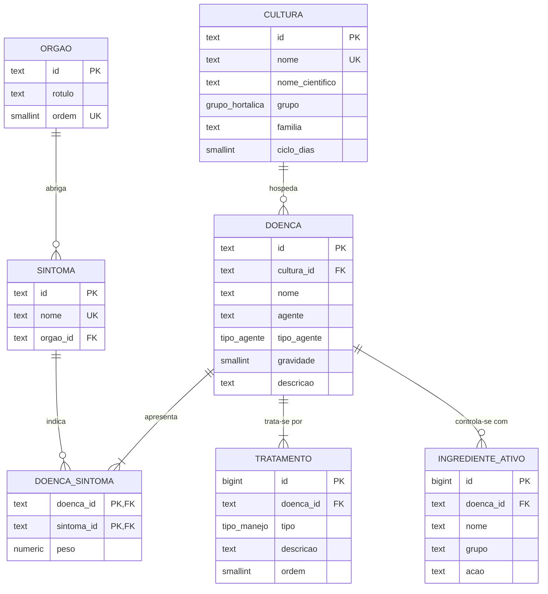
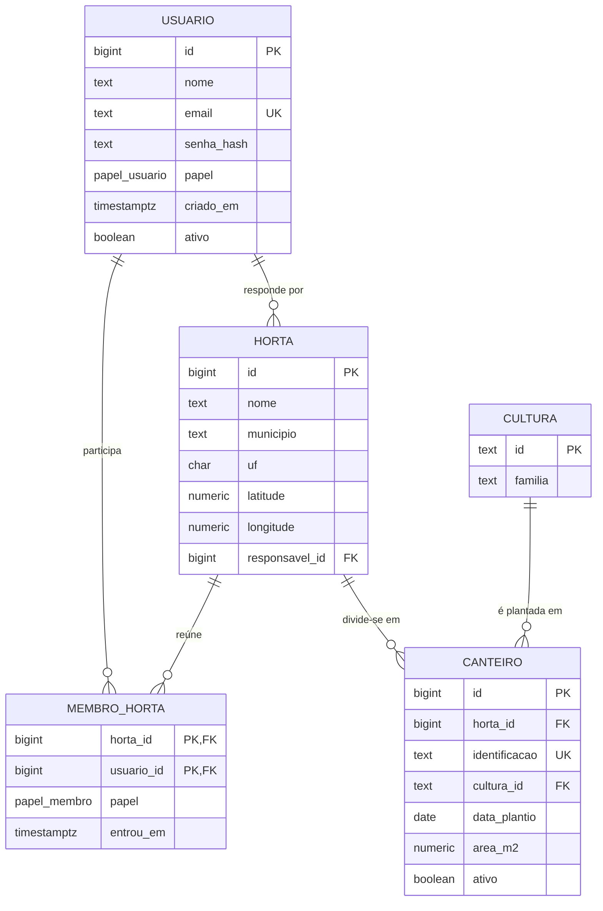
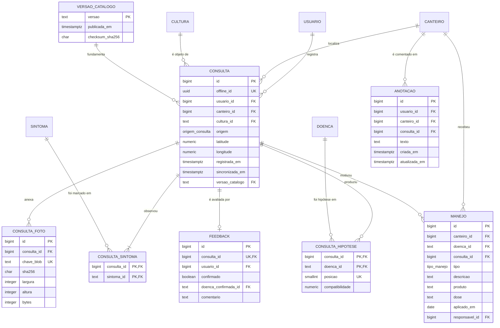

# AgroScan — Modelo de Dados

**Componente do Artefato 3 — Especificação Técnica do Sistema**

| | |
|---|---|
| **SGBD** | PostgreSQL 16 |
| **Script de criação** | [`migracoes/001_esquema_inicial.sql`](../migracoes/001_esquema_inicial.sql) |
| **Script de reversão** | [`migracoes/001_esquema_inicial_reverter.sql`](../migracoes/001_esquema_inicial_reverter.sql) |
| **Entidades** | 19 tabelas de aplicação + 1 de controle de migração |
| **Versão** | 1.0 |

---

## 1. Visão geral

O modelo se organiza em quatro subdomínios, com dependência em uma única direção — o diagnóstico referencia o catálogo, nunca o contrário:

```
┌─────────────────────────────────────────────────────────┐
│  1. CATÁLOGO AGRONÔMICO                    8 tabelas    │
│  Conteúdo curado: culturas, sintomas, doenças,          │
│  tratamentos, ingredientes ativos.                      │
│  Carga automatizada — nunca editado no banco.           │
└───────────────────────┬─────────────────────────────────┘
                        │ referenciado por
┌───────────────────────▼─────────────────────────────────┐
│  2. IDENTIDADE E HORTA                     4 tabelas    │
│  Usuários, hortas, membros, canteiros.                  │
│  Torna o dado compartilhável entre pessoas.             │
└───────────────────────┬─────────────────────────────────┘
                        │
┌───────────────────────▼─────────────────────────────────┐
│  3. DIAGNÓSTICO                            4 tabelas    │
│  Consultas, sintomas marcados, hipóteses, fotos.        │
│  Escrita idempotente, vinda da fila offline.            │
└───────────────────────┬─────────────────────────────────┘
                        │
┌───────────────────────▼─────────────────────────────────┐
│  4. ACOMPANHAMENTO                         3 tabelas    │
│  Feedback, manejo aplicado, anotações.                  │
│  Fecha o ciclo: diagnosticou → interveio → confirmou.   │
└─────────────────────────────────────────────────────────┘
```

**Por que o banco existe.** O catálogo agronômico, por si só, é conteúdo estático — poderia viver num arquivo. O que exige um banco relacional são os subdomínios 2, 3 e 4: dado transacional, escrito por várias pessoas, consultado por agregação, e que precisa de integridade referencial e de garantia de unicidade sob concorrência. As consultas da seção 6 não têm equivalente prático fora do SQL.

---

## 2. Modelo conceitual

As entidades e seus relacionamentos, sem detalhe de implementação.

| Entidade | Descrição |
|---|---|
| **Cultura** | Uma das 24 hortaliças do escopo, classificada por grupo (parte comestível) e por família botânica |
| **Órgão** | Parte da planta onde um sintoma é observado |
| **Sintoma** | Manifestação visível, catalogada uma única vez e compartilhada entre culturas |
| **Doença** | A ficha agronômica: agente causal, gravidade, descrição e condições favoráveis |
| **Tratamento** | Medida de manejo — cultural, biológica ou química |
| **Ingrediente ativo** | Referência técnica de controle químico |
| **Versão do catálogo** | Publicação datada do conteúdo curado |
| **Usuário** | Produtor, agrônomo ou administrador |
| **Horta** | Área cultivada, individual ou coletiva |
| **Canteiro** | Unidade de cultivo dentro de uma horta, com uma cultura plantada |
| **Consulta** | Um diagnóstico realizado, com data, local e versão do catálogo |
| **Foto** | Registro visual anexado a uma consulta |
| **Feedback** | Confirmação, pelo produtor, de que o diagnóstico se sustentou |
| **Manejo** | Intervenção efetivamente aplicada num canteiro |
| **Anotação** | Registro em texto livre do caderno de campo |

### Relacionamentos e cardinalidades

| Relacionamento | Cardinalidade | Leitura |
|---|---|---|
| Órgão — Sintoma | 1 : N | um órgão abriga vários sintomas; cada sintoma ocorre em um órgão |
| Cultura — Doença | 1 : N | uma cultura tem várias doenças; cada ficha pertence a uma cultura |
| Doença — Sintoma | **N : N** | uma doença apresenta vários sintomas, com **peso**; um sintoma ocorre em várias doenças |
| Doença — Tratamento | 1 : N | cada doença tem várias medidas de manejo |
| Doença — Ingrediente ativo | 1 : N | cada doença tem zero ou mais ingredientes de referência |
| Usuário — Horta | **N : N** | uma pessoa participa de várias hortas; uma horta tem vários membros |
| Horta — Canteiro | 1 : N | uma horta tem vários canteiros |
| Cultura — Canteiro | 1 : N | uma cultura é plantada em vários canteiros |
| Usuário — Consulta | 1 : N | uma pessoa registra várias consultas |
| Canteiro — Consulta | 1 : N (opcional) | uma consulta pode estar vinculada a um canteiro |
| Consulta — Sintoma | **N : N** | os sintomas marcados naquela consulta |
| Consulta — Doença | **N : N** | as hipóteses produzidas, com **posição** e **compatibilidade** |
| Consulta — Foto | 1 : N | uma consulta pode ter várias fotos |
| Consulta — Feedback | **1 : 1** | no máximo um feedback por consulta |
| Canteiro — Manejo | 1 : N | o histórico de intervenções do canteiro |

Os quatro relacionamentos N:N geram tabelas associativas. Três delas carregam **atributos próprios** — o peso em `doenca_sintoma`, e a posição e a compatibilidade em `consulta_hipotese` — o que as torna entidades associativas, não meras tabelas de ligação.

---

## 3. Diagrama Entidade-Relacionamento

### 3.1 Catálogo agronômico



### 3.2 Identidade, horta e canteiros



### 3.3 Diagnóstico e acompanhamento



---

## 4. Dicionário de dados

### 4.1 Tipos enumerados

| Tipo | Valores | Observação |
|---|---|---|
| `grupo_hortalica` | fruto, folha, flor, haste, raiz | Classificação da Embrapa por parte comestível; `raiz` cobre raízes, tubérculos, bulbos e rizomas |
| `tipo_agente` | fungo, oomiceto, bactéria, vírus, nematoide, ácaro, abiótico | `oomiceto` é separado de `fungo` de propósito — os míldios são oomicetos e respondem a grupos químicos distintos |
| `tipo_manejo` | cultural, biológico, químico | A ordem dos rótulos no tipo é a ordem de apresentação: manejo integrado começa pelo cultural |
| `papel_usuario` | produtor, agrônomo, admin | Controla o acesso aos relatórios |
| `papel_membro` | responsável, membro | Papel dentro de uma horta específica |
| `origem_consulta` | sintomas, imagem | Distingue o fluxo que originou o diagnóstico |

### 4.2 Tabelas — resumo

| # | Tabela | Chave primária | Registros esperados | Origem do dado |
|---|---|---|---|---|
| 1 | `versao_catalogo` | `versao` | ~10 | Publicação do catálogo |
| 2 | `orgao` | `id` | 5 | Carga automatizada |
| 3 | `cultura` | `id` | 24 | Carga automatizada |
| 4 | `sintoma` | `id` | ~90 | Carga automatizada |
| 5 | `doenca` | `id` | 88 | Carga automatizada |
| 6 | `doenca_sintoma` | `(doenca_id, sintoma_id)` | ~450 | Carga automatizada |
| 7 | `tratamento` | `id` | ~350 | Carga automatizada |
| 8 | `ingrediente_ativo` | `id` | ~200 | Carga automatizada |
| 9 | `usuario` | `id` | Crescente | Cadastro |
| 10 | `horta` | `id` | Crescente | Usuário |
| 11 | `membro_horta` | `(horta_id, usuario_id)` | Crescente | Usuário |
| 12 | `canteiro` | `id` | Crescente | Usuário |
| 13 | `consulta` | `id` | Crescente | Sincronização da fila offline |
| 14 | `consulta_sintoma` | `(consulta_id, sintoma_id)` | Crescente | Sincronização |
| 15 | `consulta_hipotese` | `(consulta_id, doenca_id)` | Crescente | Sincronização |
| 16 | `consulta_foto` | `id` | Crescente | Sincronização |
| 17 | `feedback` | `id` | Crescente | Usuário |
| 18 | `manejo` | `id` | Crescente | Usuário |
| 19 | `anotacao` | `id` | Crescente | Usuário |

O detalhamento de cada coluna, com tipo, nulidade e restrição, está comentado diretamente em [`001_esquema_inicial.sql`](../migracoes/001_esquema_inicial.sql).

---

## 5. Decisões de modelagem

### 5.1 Chaves naturais no catálogo, artificiais nas transações

O catálogo usa **chave natural em texto**: `cultura.id = 'tomate'`, `doenca.id = 'tomate_pinta_preta'`. Esses identificadores vêm da base curada, são estáveis, legíveis, e aparecem em URLs e em arquivos de teste. Substituí-los por sequências exigiria manter uma coluna de código único de qualquer forma, sem ganho — e tornaria ilegível qualquer inspeção manual dos dados.

As tabelas transacionais usam **chave artificial** (`GENERATED ALWAYS AS IDENTITY`), porque não existe identificador natural estável para uma consulta ou um manejo.

### 5.2 `offline_id`: a restrição que garante a idempotência

A consulta nasce no aparelho, ainda sem rede, já com um UUID próprio. Quando a fila sincroniza, o servidor usa esse identificador para reconhecer reenvio:

```sql
INSERT INTO consulta (offline_id, usuario_id, ...) VALUES (...)
ON CONFLICT (offline_id) DO NOTHING
RETURNING id;
```

A `UNIQUE (offline_id)` **não está no modelo por desempenho** — ela é a garantia de que um reenvio não duplica o registro. Deixar essa verificação apenas na aplicação permitiria duplicata sob envio concorrente, que numa fila com repetição automática é o caso normal, não a exceção.

### 5.3 `versao_catalogo` na consulta: o histórico auditável

Um diagnóstico calculado com o catálogo de setembro e reinterpretado com o de novembro produz resultado diferente — os pesos dos sintomas podem ter sido revisados. Registrar a versão usada é o que permite reproduzir e auditar um diagnóstico antigo, em vez de recalculá-lo com premissas que não eram as vigentes.

### 5.4 `consulta.cultura_id` não é redundância

O canteiro já tem uma cultura, e a consulta vinculada a um canteiro parece herdá-la. Mas são **fatos distintos**: `canteiro.cultura_id` é o que está plantado *agora*; `consulta.cultura_id` é o que foi diagnosticado *naquele dia*. Quando o canteiro é replantado com outra cultura, o diagnóstico anterior precisa continuar dizendo a verdade.

É também o que permite que a consulta sobreviva à exclusão do canteiro (`ON DELETE SET NULL`) sem perder sentido, e que exista consulta sem canteiro nenhum — o caso de quem usa o aplicativo sem cadastrar a horta.

### 5.5 Restrições que codificam regras agronômicas

O banco recusa dados que a agronomia não admite. Estas são as restrições que carregam conhecimento de domínio, não apenas tipo:

| Restrição | Regra que codifica |
|---|---|
| `doenca_sintoma_peso_faixa` — peso em (0, 1] | Peso zero não existe: sintoma que a doença não apresenta simplesmente não tem linha, e essa ausência é o que permite ao motor penalizar o sintoma não explicado |
| `doenca_gravidade_faixa` — 1 a 5 | Escala fechada, apresentada com rótulo textual além da cor |
| `manejo_produto_e_quimico` | Produto comercial só se declara em manejo do tipo químico |
| `feedback_coerente` | Diagnóstico confirmado não pode apontar uma doença diferente |
| `anotacao_tem_contexto` | Anotação precisa estar ligada a um canteiro ou a uma consulta — solta, não é recuperável |
| `horta_coordenada_completa` e `consulta_coordenada_completa` | Coordenada pela metade é pior que ausente: aponta para o equador ou para Greenwich |
| `consulta_nao_e_do_futuro` | Relógio errado no aparelho, com folga de um dia para não rejeitar registro legítimo por fuso |

Duas regras deliberadamente **não** estão no banco, porque pertencem à aplicação: o limiar de compatibilidade de 15% (o banco só valida que o valor está entre 0 e 1) e o mínimo de três doenças por cultura, que é verificado pelo validador da base antes da carga — o banco receberia um estado transitoriamente inválido durante a curadoria.

### 5.6 Comportamento na exclusão

| Referência | Ação | Razão |
|---|---|---|
| `consulta.usuario_id` | CASCADE | A exclusão de conta exigida pela LGPD precisa remover o histórico |
| `consulta.canteiro_id` | SET NULL | Apagar um canteiro não deve apagar o diagnóstico feito nele |
| `horta.responsavel_id` | RESTRICT | Excluir quem responde por uma horta coletiva apagaria trabalho de outras pessoas; exige transferir a responsabilidade antes |
| `manejo.responsavel_id` | RESTRICT | O registro de aplicação de defensivo tem valor de rastreabilidade e não deve perder a autoria |
| `consulta_hipotese.doenca_id` | RESTRICT | Uma doença referenciada por histórico não pode desaparecer do catálogo |
| Tabelas associativas | CASCADE | Existem apenas em função da entidade pai |

### 5.7 A imagem fica fora do banco

`consulta_foto` guarda a **chave** do objeto no armazenamento externo, seu tamanho e seu hash — nunca o binário. Guardar arquivo em coluna infla o backup, encarece toda consulta que traga a linha e consome o limite do plano gratuito. O hash permite verificar integridade e detectar duplicata.

---

## 6. As consultas que justificam o modelo relacional

Cada relatório previsto no backlog corresponde a uma agregação que atravessa várias tabelas — o tipo de operação que não teria equivalente prático fora do SQL.

### 6.1 Incidência de doenças por mês numa horta *(US27)*

```sql
SELECT date_trunc('month', c.registrada_em) AS mes,
       d.nome                               AS doenca,
       cu.nome                              AS cultura,
       count(*)                             AS ocorrencias
  FROM consulta c
  JOIN consulta_hipotese h ON h.consulta_id = c.id AND h.posicao = 1
  JOIN doenca d            ON d.id = h.doenca_id
  JOIN cultura cu          ON cu.id = c.cultura_id
  JOIN canteiro ca         ON ca.id = c.canteiro_id
 WHERE ca.horta_id = $1
   AND c.registrada_em >= $2
   AND c.registrada_em <  $3
 GROUP BY mes, d.nome, cu.nome
 ORDER BY mes DESC, ocorrencias DESC;
```

O filtro `h.posicao = 1` é essencial: agregar todas as hipóteses contaria como ocorrência a doença que o motor apenas considerou e descartou.

### 6.2 Acurácia percebida por doença *(US28)*

```sql
SELECT d.nome,
       count(*)                                            AS avaliadas,
       count(*) FILTER (WHERE f.confirmado)                AS confirmadas,
       round(100.0 * count(*) FILTER (WHERE f.confirmado)
                   / count(*), 1)                          AS taxa_pct
  FROM feedback f
  JOIN consulta_hipotese h ON h.consulta_id = f.consulta_id AND h.posicao = 1
  JOIN doenca d            ON d.id = h.doenca_id
 GROUP BY d.nome
HAVING count(*) >= 5
 ORDER BY taxa_pct;
```

O `HAVING count(*) >= 5` evita apresentar taxa de 0% ou 100% calculada sobre uma única avaliação. Ordenar ascendente coloca no topo as doenças em que o sistema mais erra — que é o que orienta a próxima revisão da curadoria.

### 6.3 Sintomas mais marcados por cultura *(US29)*

```sql
SELECT cu.nome AS cultura, s.nome AS sintoma, count(*) AS marcacoes
  FROM consulta_sintoma cs
  JOIN consulta c  ON c.id = cs.consulta_id
  JOIN cultura cu  ON cu.id = c.cultura_id
  JOIN sintoma s   ON s.id = cs.sintoma_id
 GROUP BY cu.nome, s.nome
 ORDER BY cu.nome, marcacoes DESC;
```

Alimenta a decisão de curadoria: sintoma muito marcado numa cultura com poucas doenças cadastradas indica onde a base precisa crescer.

### 6.4 Alerta de rotação de culturas *(US30)*

```sql
SELECT ca.identificacao,
       cu_atual.nome    AS cultura_atual,
       cu_atual.familia AS familia,
       count(*)         AS ciclos_seguidos_na_familia
  FROM canteiro ca
  JOIN cultura cu_atual ON cu_atual.id = ca.cultura_id
  JOIN canteiro ant     ON ant.horta_id = ca.horta_id
                       AND ant.identificacao = ca.identificacao
                       AND NOT ant.ativo
  JOIN cultura cu_ant   ON cu_ant.id = ant.cultura_id
                       AND cu_ant.familia = cu_atual.familia
 WHERE ca.horta_id = $1
   AND ca.ativo
 GROUP BY ca.identificacao, cu_atual.nome, cu_atual.familia
HAVING count(*) >= 2;
```

Este relatório **só existe porque `familia` entrou no modelo**. Repetir a mesma família botânica no mesmo canteiro perpetua patógeno de solo — plantar batata depois de tomate é, do ponto de vista fitopatológico, plantar a mesma coisa duas vezes.

### 6.5 Histórico completo de um canteiro

```sql
SELECT c.registrada_em, d.nome AS hipotese_principal,
       h.compatibilidade, f.confirmado,
       m.tipo AS manejo_aplicado, m.aplicado_em
  FROM consulta c
  LEFT JOIN consulta_hipotese h ON h.consulta_id = c.id AND h.posicao = 1
  LEFT JOIN doenca d            ON d.id = h.doenca_id
  LEFT JOIN feedback f          ON f.consulta_id = c.id
  LEFT JOIN manejo m            ON m.consulta_id = c.id
 WHERE c.canteiro_id = $1
 ORDER BY c.registrada_em DESC;
```

É a consulta que materializa o ciclo completo — diagnosticou, interveio, confirmou — numa única linha por evento.

---

## 7. Normalização

O modelo está na **Terceira Forma Normal (3FN)**:

- **1FN** — todos os atributos são atômicos. Os sintomas de uma doença, que numa modelagem ingênua seriam uma lista num campo texto, estão na tabela associativa `doenca_sintoma`. As condições favoráveis são três colunas distintas, não um bloco de texto estruturado.
- **2FN** — em todas as tabelas de chave composta, os atributos não-chave dependem da chave inteira. O `peso` em `doenca_sintoma` depende do par (doença, sintoma) — não da doença nem do sintoma isoladamente. A `compatibilidade` em `consulta_hipotese` depende do par (consulta, doença).
- **3FN** — não há dependência transitiva. `doenca` não guarda o nome nem a família da cultura, apenas a referência; `consulta` não guarda o nome da doença hipotetizada.

**Aparente exceção, examinada:** `consulta.cultura_id` coexiste com `canteiro.cultura_id`. Não é violação de 3FN, porque não há dependência funcional entre as duas: a cultura da consulta é o que foi diagnosticado na data do registro, e a do canteiro é o que está plantado no momento presente. São fatos independentes que coincidem com frequência, e a coincidência não os torna o mesmo dado — como demonstrado na seção 5.4.

**Nenhuma desnormalização por desempenho foi adotada.** O volume esperado (dezenas de milhares de consultas, no máximo) não justifica abrir mão de integridade. Se um relatório se mostrar lento, o caminho é visão materializada, que mantém a fonte normalizada.

---

## 8. Provisão para escopo condicionado

A identificação automática de doenças por imagem é escopo condicionado (seções 6 e 11.2 do Documento de Software v2). Caso a auditoria do acervo de imagens confirme viabilidade, três entidades serão acrescentadas numa migração posterior:

| Entidade | Papel |
|---|---|
| `dataset_imagem` | Acervo utilizado, com fonte, licença e data de auditoria |
| `classe_visao` | Mapeia cada índice de saída do modelo para uma cultura e uma doença do catálogo |
| `modelo_treinado` | Modelo publicado, com hash do arquivo, acurácia medida e limiares de recusa calibrados |

**A direção da dependência é deliberada:** essas tabelas referenciam `cultura` e `doenca`, e nunca o contrário. O catálogo agronômico não carrega identidade de nenhum acervo de imagens. Isso permite que mais de um acervo coexista, que o escopo do aplicativo seja maior do que o do modelo, e que trocar de acervo seja uma operação de inserção de dados — não uma alteração de esquema.

---

## 9. Verificação

O esquema é aplicado e conferido pela integração contínua:

```bash
# Aplicar em banco limpo
psql "$DATABASE_URL_DIRETA" -f migracoes/001_esquema_inicial.sql

# Carregar o catálogo curado (idempotente)
python -m app.seed

# Reverter integralmente
psql "$DATABASE_URL_DIRETA" -f migracoes/001_esquema_inicial_reverter.sql
```

As migrações usam a conexão **direta** e não a agrupada: comandos de definição de esquema não sobrevivem ao agrupamento por transação usado em tempo de execução.

A carga do catálogo é idempotente e nunca escrita à mão — `python -m app.seed` lê a base curada, valida e aplica. Nenhum `INSERT` de doença é digitado manualmente, o que elimina a classe de erro em que um identificador com erro de digitação desapareceria em silêncio do perfil de uma doença.
