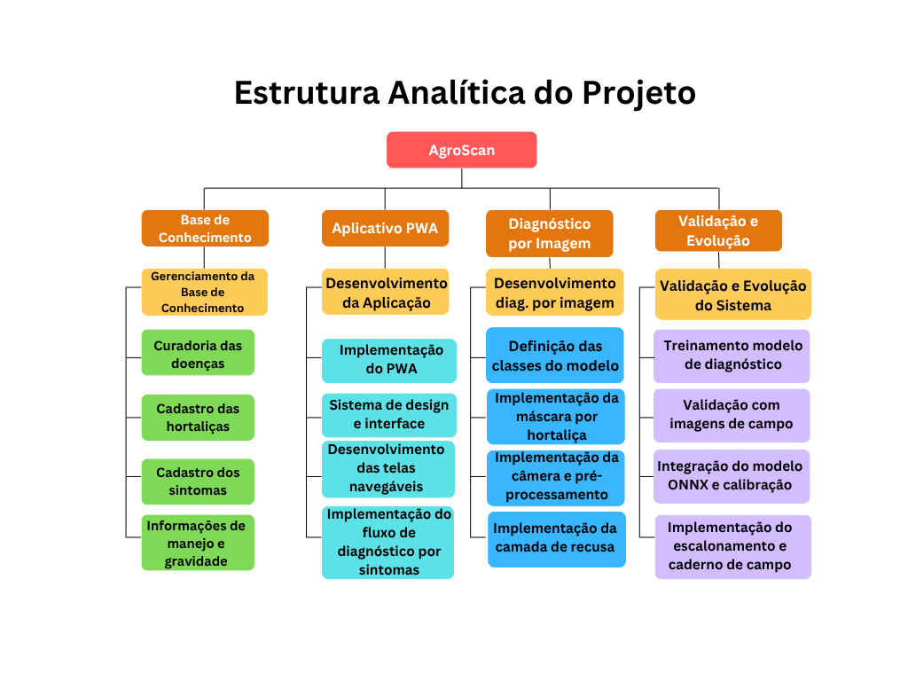

# Artefato 2 - Gestão do Projeto

## EAP · Backlog do produto · Planejamento das sprints · Projeto no repositório institucional

| Campo | Informação |
| --- | --- |
| Projeto | AgroScan - PWA para diagnóstico de doenças em hortaliças |
| Disciplina | Projeto Integrador II |
| Turma | B |
| Instituição | CEUB - Centro Universitário de Brasília |
| Professora responsável | Adriana Falcomer Pontes |
| IDProjeto | 20260286 |
| Equipe | Gabriela Pedersoli Caldana (22404253) · Thaís Regina Dias da Mota (22403754) |
| Entrega | 14/09/2026 |
| Sprint | Sprint 1 - Especificação e gestão |
| Repositório institucional | `CampusCEUB/AgroScan` |
| Repositório de código | https://github.com/gabicaldana/AgroScan2 |

---

# 1. EAP - Estrutura Analítica do Projeto

A EAP decompõe o projeto em sete pacotes de entrega. A organização segue as
fronteiras técnicas reais do sistema, e não a ordem cronológica: a curadoria
agronômica (pacote 2) e o desenvolvimento da aplicação (pacotes 4 e 5) correm em
paralelo durante todo o semestre, porque a curadoria é trabalho de pesquisa e
não depende do código para avançar.



**Figura 1 - Estrutura Analítica do Projeto.** Elaboração: Thaís Regina Dias da
Mota.

O diagrama organiza o trabalho em quatro frentes. A decomposição textual a
seguir a desdobra em **sete pacotes**, separando o back-end e o banco de dados
numa frente própria: quando o diagrama foi elaborado, o sistema ainda era
puramente cliente, e a camada de servidor passou a existir depois.

```mermaid
graph TD
    A[AgroScan]

    A --> G[1. Gestão do projeto]
    G --> G1[1.1 Artefatos acadêmicos]
    G --> G2[1.2 Eventos Scrum]
    G --> G3[1.3 Repositório institucional]

    A --> B[2. Base de conhecimento]
    B --> B1[2.1 Modelagem do catálogo]
    B --> B2[2.2 Curadoria por família botânica]
    B --> B3[2.3 Validação automática]
    B --> B4[2.4 Fontes e referências técnicas]

    A --> M[3. Motor de diagnóstico]
    M --> M1[3.1 Índice de compatibilidade ponderado]
    M --> M2[3.2 Pergunta de desempate]
    M --> M3[3.3 Porte TypeScript e paridade]
    M --> M4[3.4 Limiar de recusa]

    A --> P[4. Aplicativo PWA]
    P --> P1[4.1 Sistema de design de campo]
    P --> P2[4.2 Telas do fluxo de diagnóstico]
    P --> P3[4.3 Instalação e service worker]
    P --> P4[4.4 Fila de sincronização offline]

    A --> S[5. Back-end e banco de dados]
    S --> S1[5.1 Modelo relacional e migrações]
    S --> S2[5.2 API REST]
    S --> S3[5.3 Autenticação e LGPD]
    S --> S4[5.4 Carga do catálogo]
    S --> S5[5.5 Relatórios agregados]

    A --> I[6. Diagnóstico por imagem - condicionado]
    I --> I1[6.1 Contrato de pré-processamento]
    I --> I2[6.2 Câmera e captura]
    I --> I3[6.3 Camada de recusa]
    I --> I4[6.4 Auditoria do acervo e modelo]

    A --> V[7. Validação e extensão]
    V --> V1[7.1 Testes automatizados e CI]
    V --> V2[7.2 Auditoria de acessibilidade]
    V --> V3[7.3 Apresentação à comunidade]
    V --> V4[7.4 Relatórios de extensão]
```



## 1.1 EAP em forma de lista

Versão textual da mesma decomposição, com o estado atual de cada pacote de
trabalho. O estado é verificável no repositório de código.

| Legenda | Significado |
| --- | --- |
| ✅ | Concluído e verificado por teste automatizado ou inspeção |
| 🔄 | Em andamento |
| ⬜ | Não iniciado |
| 🟡 | Parcial - a parte que depende da equipe está pronta; falta insumo externo |

- **1. Gestão do projeto**
  - 1.1 Artefatos acadêmicos - 🔄
  - 1.2 Eventos Scrum: planejamento, revisão e retrospectiva - 🔄
  - 1.3 Repositório institucional: requisitos, arquitetura, sprints, entregas, ADRs - 🔄
- **2. Base de conhecimento**
  - 2.1 Modelagem do catálogo: órgãos, sintomas, culturas, doenças, tratamentos, ingredientes ativos - ✅
  - 2.2 Curadoria por família botânica - 🔄 *(3 de 24 culturas, 13 de 88 doenças)*
  - 2.3 Validação automática da base - ✅
  - 2.4 Fontes e referências técnicas - 🔄
- **3. Motor de diagnóstico**
  - 3.1 Índice de compatibilidade ponderado - ✅
  - 3.2 Pergunta de desempate - ✅
  - 3.3 Porte TypeScript com paridade exata por fixtures - ✅
  - 3.4 Limiar mínimo de apresentação de hipótese - ✅
- **4. Aplicativo PWA**
  - 4.1 Sistema de design "ferramenta de campo" - ✅
  - 4.2 Telas do fluxo de diagnóstico: cultura, sintomas, resultado, laudo - ✅
  - 4.3 Instalação e service worker escrito à mão - ✅
  - 4.4 Fila de sincronização offline - ✅
- **5. Back-end e banco de dados**
  - 5.1 Modelo relacional, DDL numerado e reversível - ✅
  - 5.2 API REST: saúde, catálogo, diagnóstico, caderno - ✅
  - 5.3 Autenticação com scrypt e JWT; exclusão de conta - 🟡 *(API pronta; tela de exclusão pendente)*
  - 5.4 Carga idempotente do catálogo - ✅
  - 5.5 Relatórios agregados - ⬜
  - 5.6 Hortas, membros, canteiros e manejo - ⬜ *(tabelas modeladas; rotas e telas pendentes)*
- **6. Diagnóstico por imagem - escopo condicionado**
  - 6.1 Contrato de pré-processamento com paridade de pixel - ✅
  - 6.2 Câmera e captura em resolução nativa - 🟡 *(pronta e testada; fora da navegação até existir modelo - ADR 0008)*
  - 6.3 Camada de recusa sobre logits crus - 🟡 *(implementada; limiares dependem de imagens de validação)*
  - 6.4 Auditoria do acervo e treinamento do modelo - ⬜
- **7. Validação e extensão**
  - 7.1 Testes automatizados e integração contínua - ✅ *(176 testes)*
  - 7.2 Auditoria de acessibilidade - ⬜
  - 7.3 Apresentação à comunidade parceira - ⬜
  - 7.4 Relatórios de extensão - ⬜

---

# 2. Backlog do produto

## 2.1 Épicos

| ID | Épico | Descrição | Estado |
| --- | --- | --- | --- |
| **E1** | Base de conhecimento de hortaliças | Curadoria agronômica das 24 culturas e 88 fichas de doença | 🔄 15% |
| **E2** | Diagnóstico por sintomas offline | Motor de diagnóstico e telas de consulta | ✅ |
| **E3** | Identidade e conta | Cadastro, autenticação e privacidade | 🟡 |
| **E4** | Caderno de campo | Histórico, sincronização offline e feedback | 🟡 |
| **E5** | Horta, canteiros e manejo | Organização coletiva da área cultivada | ⬜ |
| **E6** | Relatórios | Agregações sobre o histórico acumulado | ⬜ |
| **E7** | Plataforma e infraestrutura | API, banco, publicação e integração contínua | ✅ |
| **E8** | Identificação por imagem | Escopo condicionado - fora da navegação (ADR 0008) | 🟡 |

## 2.2 Requisitos funcionais

Prioridade segundo MoSCoW: **Obrigatório** (must), **Importante** (should),
**Desejável** (could).

> As tabelas a seguir reproduzem o documento canônico
> [`docs/requisitos.md`](../docs/requisitos.md), que acrescenta o estado de
> implementação de cada requisito, os critérios transversais de aceitação e a
> matriz de rastreabilidade requisito → história → sprint → verificação. Em caso
> de divergência, o documento canônico prevalece.

### 2.2.1 Diagnóstico

| ID | Requisito | Prioridade |
| --- | --- | --- |
| RF01 | O sistema deve permitir ao usuário selecionar a hortaliça, com as culturas agrupadas por grupo (fruto, folha, flor, haste, raiz) | Obrigatório |
| RF02 | O sistema deve apresentar os sintomas da cultura selecionada, agrupados pelo órgão da planta em que ocorrem | Obrigatório |
| RF03 | O sistema deve permitir marcar e desmarcar os sintomas observados | Obrigatório |
| RF04 | O sistema deve calcular e apresentar as hipóteses de doença ordenadas por grau de compatibilidade | Obrigatório |
| RF05 | O sistema deve informar quando nenhuma hipótese atinge a compatibilidade mínima, em vez de apresentar a menos improvável | Obrigatório |
| RF06 | O sistema deve sugerir um sintoma adicional a observar quando as duas primeiras hipóteses estiverem próximas | Importante |
| RF07 | O sistema deve exibir, para cada hipótese, o laudo com nome, agente causal, descrição, nível de gravidade e condições favoráveis | Obrigatório |
| RF08 | O sistema deve apresentar as medidas de manejo na ordem cultural → biológica → química | Obrigatório |
| RF09 | O sistema deve exibir o aviso legal e a exigência de receituário agronômico em todo laudo | Obrigatório |
| RF10 | O sistema deve permitir capturar foto da planta pela câmera do dispositivo | Desejável |
| RF11 | O sistema deve informar explicitamente quando a identificação automática por imagem não estiver disponível | Obrigatório |

### 2.2.2 Conta e identidade

| ID | Requisito | Prioridade |
| --- | --- | --- |
| RF12 | O sistema deve permitir o cadastro de usuário com nome, e-mail e senha | Obrigatório |
| RF13 | O sistema deve autenticar o usuário e manter a sessão | Obrigatório |
| RF14 | O sistema deve permitir o uso do diagnóstico sem cadastro, exigindo conta apenas para salvar histórico | Importante |
| RF15 | O sistema deve permitir a exclusão da conta e dos dados associados | Obrigatório |

### 2.2.3 Caderno de campo

| ID | Requisito | Prioridade |
| --- | --- | --- |
| RF16 | O sistema deve registrar cada consulta realizada, com cultura, sintomas marcados, hipóteses e data | Obrigatório |
| RF17 | O sistema deve armazenar localmente as consultas feitas sem conexão e enviá-las quando houver rede | Obrigatório |
| RF18 | O sistema não deve duplicar uma consulta reenviada pela fila de sincronização | Obrigatório |
| RF19 | O sistema deve listar o histórico de consultas com filtro por período, cultura e canteiro | Obrigatório |
| RF20 | O sistema deve permitir registrar se o diagnóstico se confirmou e qual foi a doença real | Importante |
| RF21 | O sistema deve permitir anotações livres associadas a um canteiro ou consulta | Desejável |
| RF22 | O sistema deve registrar a geolocalização da consulta, mediante consentimento explícito | Desejável |

### 2.2.4 Horta e canteiros

| ID | Requisito | Prioridade |
| --- | --- | --- |
| RF23 | O sistema deve permitir cadastrar uma horta com nome e município | Importante |
| RF24 | O sistema deve permitir associar outros usuários a uma horta | Importante |
| RF25 | O sistema deve permitir cadastrar canteiros com identificação, cultura e data de plantio | Importante |
| RF26 | O sistema deve permitir vincular uma consulta a um canteiro | Importante |
| RF27 | O sistema deve permitir registrar o manejo aplicado, com tipo, descrição, produto e data | Desejável |

### 2.2.5 Relatórios

| ID | Requisito | Prioridade |
| --- | --- | --- |
| RF28 | O sistema deve apresentar a incidência de doenças por período em uma horta | Importante |
| RF29 | O sistema deve apresentar os sintomas mais frequentemente marcados por cultura | Desejável |
| RF30 | O sistema deve apresentar a taxa de confirmação dos diagnósticos por doença | Desejável |
| RF31 | O sistema deve alertar quando culturas da mesma família botânica se repetirem no mesmo canteiro | Desejável |
| RF37 | O sistema deve apresentar os indicadores agregados em painéis visuais incorporados à interface | Importante |

### 2.2.6 Plataforma

| ID | Requisito | Prioridade |
| --- | --- | --- |
| RF32 | O sistema deve ser instalável como aplicativo no celular (PWA) | Obrigatório |
| RF33 | O sistema deve disponibilizar API REST para consulta ao catálogo e ao diagnóstico | Obrigatório |
| RF34 | O sistema deve sincronizar o catálogo quando houver versão mais recente no servidor | Importante |
| RF35 | O sistema deve registrar, em cada consulta, a versão do catálogo usada no diagnóstico | Importante |
| RF36 | O sistema deve indicar visualmente ao usuário quando está operando sem conexão | Importante |

## 2.3 Requisitos não funcionais

### 2.3.1 Disponibilidade e desempenho

| ID | Requisito |
| --- | --- |
| RNF01 | O diagnóstico por sintomas deve funcionar integralmente sem conexão, incluindo a primeira consulta após a instalação |
| RNF02 | O cálculo do diagnóstico no dispositivo deve responder em menos de 100 ms |
| RNF03 | As requisições à API devem responder em até 3 segundos no percentil 95, considerando a inicialização a frio do ambiente serverless |
| RNF04 | O aplicativo deve carregar em até 3 segundos em conexão 3G |

### 2.3.2 Usabilidade e acessibilidade

| ID | Requisito |
| --- | --- |
| RNF05 | A interface deve atender ao nível AAA de contraste da WCAG 2.1 |
| RNF06 | Os alvos de toque devem ter no mínimo 56 pixels, para uso com luvas |
| RNF07 | O corpo de texto deve ter no mínimo 18 pixels |
| RNF08 | Nenhuma informação pode ser transmitida exclusivamente por cor |
| RNF09 | A interface deve ser integralmente em português brasileiro |
| RNF10 | A interface deve ser responsiva, com prioridade para telas de celular |
| RNF11 | O aplicativo deve usar tema claro fixo, sem herdar o modo escuro do sistema operacional |

### 2.3.3 Segurança e privacidade

| ID | Requisito |
| --- | --- |
| RNF12 | As senhas devem ser armazenadas com função de derivação de chave (scrypt), nunca em texto claro |
| RNF13 | A autenticação deve usar token com prazo de expiração |
| RNF14 | Toda comunicação deve ocorrer sobre HTTPS |
| RNF15 | O sistema deve coletar apenas os dados pessoais necessários à sua finalidade, em conformidade com a LGPD |
| RNF16 | A geolocalização deve ser sempre opcional e solicitada com consentimento explícito |
| RNF17 | O usuário deve poder excluir sua conta e seus dados de forma efetiva |

### 2.3.4 Confiabilidade e manutenibilidade

| ID | Requisito |
| --- | --- |
| RNF18 | A base de conhecimento deve ser validada automaticamente antes de qualquer carga; referências quebradas, pesos fora da faixa e fichas incompletas devem impedir a publicação |
| RNF19 | As implementações do motor de diagnóstico devem produzir resultados idênticos, verificados por testes automatizados sobre casos compartilhados |
| RNF20 | A integração contínua deve bloquear a entrada de código cujos artefatos gerados estejam desatualizados em relação às suas fontes |
| RNF21 | O código e a documentação devem ser versionados em repositório Git com histórico rastreável |

### 2.3.5 Restrições de projeto

| ID | Requisito |
| --- | --- |
| RNF22 | A infraestrutura deve operar dentro dos limites de camadas gratuitas de serviços em nuvem |
| RNF23 | O front-end e o back-end devem ser publicados em ambiente acessível publicamente por URL |
| RNF24 | O banco de dados deve ser relacional |

### 2.3.6 Compatibilidade e distribuição

| ID | Requisito |
| --- | --- |
| RNF25 | O sistema deve ser instalável como PWA em Android, iOS e desktop, a partir de URL pública, sem depender de loja de aplicativos |
| RNF26 | O sistema deve funcionar nas versões correntes de Chrome (Android), Safari (iOS) e navegadores Chromium (desktop) |
| RNF27 | O sistema deve apresentar instruções de instalação específicas para iOS, ambiente sem solicitação automática de instalação |
| RNF28 | A sincronização da fila não deve depender de sincronização em segundo plano; o envio deve ser disparado na abertura do aplicativo e no retorno da conexão |

## 2.4 Regras de negócio

| ID | Regra |
| --- | --- |
| RN01 | A compatibilidade entre os sintomas observados e uma doença é calculada por índice de similaridade ponderado, considerando os sintomas presentes, os esperados e ausentes, e os observados que a doença não explica |
| RN02 | Sintomas observados que a doença não explica reduzem sua compatibilidade, com peso menor do que o de um sintoma esperado e ausente |
| RN03 | Hipóteses com compatibilidade inferior a 15% não são apresentadas |
| RN04 | Toda doença cadastrada deve ter ao menos um sintoma de peso máximo - o sintoma clássico da doença |
| RN05 | Toda cultura cadastrada deve ter no mínimo três doenças, para que o sistema possa oferecer hipótese alternativa |
| RN06 | Toda doença deve ter ao menos uma medida de manejo cultural, apresentada antes das demais |
| RN07 | Doenças de agente viral não apresentam ingredientes ativos de controle direto |
| RN08 | A pergunta de desempate só afirma que uma observação descarta uma hipótese quando a hipótese alternativa de fato não espera aquele sintoma |
| RN09 | Todo laudo exibe o aviso de que a aquisição e a aplicação de defensivos exigem receituário agronômico |
| RN10 | Cada consulta registra a versão do catálogo utilizada, garantindo que o histórico permaneça auditável quando a base for atualizada |
| RN11 | Em caso de edição concorrente de um mesmo registro do caderno, prevalece a última escrita recebida |

> **Conformidade atual com a RN05.** Das três culturas curadas, tomate atende
> (10 doenças), mas **batata (2) e pimentão (1) estão abaixo do mínimo**. A
> validação automática emite aviso, e não erro, porque a base funciona - o que
> não existe nessas duas culturas é a segunda hipótese e a pergunta de
> desempate. Fechar essas duas culturas é item da Sprint 2.

## 2.5 Histórias de usuário

Estimativa em pontos de história na escala de Fibonacci: 1 trivial, 2 pequena,
3 média, 5 grande, 8 muito grande.

### E1 - Base de conhecimento

| ID | História | Critérios de aceite | Pts | Sprint | Estado |
| --- | --- | --- | --- | --- | --- |
| US01 | Como produtor, quero encontrar a hortaliça que cultivo em uma lista organizada, para não procurar num rol extenso | Culturas agrupadas por grupo; nome popular e científico visíveis; 24 culturas presentes | 3 | 2 | 🔄 3/24 |
| US02 | Como curadora, quero que a base recuse fichas incompletas, para que nenhum erro de digitação chegue ao produtor | Validação recusa referência quebrada, peso inválido, doença sem sintoma clássico e doença viral com ingrediente ativo; cultura com menos de 3 doenças gera aviso | 5 | 1 | ✅ |
| US03 | Como curadora, quero cadastrar as doenças das brássicas, para cobrir couve, repolho, brócolis, couve-flor, rúcula e agrião | 6 culturas com no mínimo 3 doenças cada; fontes citadas; validação aprovada | 8 | 2 | ⬜ |
| US04 | Como curadora, quero cadastrar as doenças das cucurbitáceas e fechar as solanáceas | Pepino, abobrinha, abóbora e jiló cobertos; batata e pimentão elevados a 3 ou mais doenças | 8 | 3 | ⬜ |
| US05 | Como curadora, quero cadastrar as doenças das demais famílias | Apiáceas, amarilidáceas, amarantáceas, asteráceas e malváceas cobertas; base fecha 24 culturas e 88 doenças | 8 | 4-5 | ⬜ |

**Subtotal E1: 32 pts**

### E2 - Diagnóstico por sintomas

| ID | História | Critérios de aceite | Pts | Sprint | Estado |
| --- | --- | --- | --- | --- | --- |
| US06 | Como produtor, quero marcar os sintomas que vejo na planta, para descobrir o que ela tem | Sintomas agrupados por órgão; marcação e desmarcação; contador de selecionados | 3 | 1 | ✅ |
| US07 | Como produtor, quero ver as doenças mais compatíveis com o que observei, para saber por onde começar | Lista ordenada por compatibilidade; barra visual e percentual; nada abaixo de 15% | 5 | 1 | ✅ |
| US08 | Como produtor, quero ser avisado quando o sistema não souber responder, para não seguir uma pista falsa | Mensagem explícita quando nenhuma hipótese atinge o limiar; orientação de procurar assistência | 2 | 1 | ✅ |
| US09 | Como produtor, quero saber qual outro sintoma procurar quando houver dúvida entre duas doenças | Pergunta apresentada quando as duas primeiras hipóteses estão próximas; o texto só promete descartar quando a alternativa realmente não espera o sintoma | 5 | 1 | ✅ |
| US10 | Como produtor, quero ler o laudo completo da doença, para saber o que fazer | Nome, agente, gravidade com rótulo textual, descrição, condições favoráveis, manejo em ordem cultural → biológica → química, aviso legal | 5 | 1 | ✅ |
| US11 | Como produtor, quero usar o aplicativo sem internet, porque no canteiro não pega sinal | Fluxo completo de diagnóstico funciona em modo avião após a instalação; indicador de ausência de rede visível | 5 | 1 | ✅ |

**Subtotal E2: 25 pts**

### E3 - Identidade e conta

| ID | História | Critérios de aceite | Pts | Sprint | Estado |
| --- | --- | --- | --- | --- | --- |
| US12 | Como produtor, quero criar uma conta, para que meu histórico não se perca | Cadastro com nome, e-mail e senha; e-mail único; senha com hash scrypt | 5 | 1 | ✅ |
| US13 | Como produtor, quero entrar na minha conta e permanecer conectado | Autenticação por token com expiração; sessão persistida no dispositivo | 3 | 1 | ✅ |
| US14 | Como visitante, quero usar o diagnóstico sem criar conta, para experimentar antes de me cadastrar | Diagnóstico acessível sem autenticação; salvar histórico solicita cadastro | 2 | 1 | ✅ |
| US15 | Como usuário, quero excluir minha conta e meus dados | Exclusão efetiva e confirmada; dados associados removidos; acessível pela interface | 3 | 6 | 🟡 API pronta, tela pendente |

**Subtotal E3: 13 pts**

### E4 - Caderno de campo

| ID | História | Critérios de aceite | Pts | Sprint | Estado |
| --- | --- | --- | --- | --- | --- |
| US16 | Como produtor, quero que minhas consultas fiquem salvas, para consultar depois o que já diagnostiquei | Consulta persistida com cultura, sintomas, hipóteses, data e versão do catálogo | 5 | 1 | ✅ |
| US17 | Como produtor, quero registrar consultas mesmo sem sinal, para não perder o que observei no campo | Consulta gravada localmente e enfileirada; envio na abertura do aplicativo e no retorno da conexão, sem depender de sincronização em segundo plano; indicador de pendências visível | 8 | 1 | ✅ |
| US18 | Como produtor, quero que uma consulta reenviada não apareça duplicada | Identificador próprio por consulta; reenvio da fila não cria registro novo; verificado por teste | 3 | 1 | ✅ |
| US19 | Como produtor, quero ver meu histórico filtrado por período e cultura | Listagem paginada com filtros; funciona a partir do armazenamento local quando sem rede | 5 | 1 | ✅ |
| US20 | Como produtor, quero informar se o diagnóstico se confirmou, para melhorar o sistema | Registro de confirmação e da doença real; um feedback por consulta | 3 | 5 | 🟡 API pronta, tela pendente |
| US21 | Como produtor, quero escrever anotações sobre um canteiro | Anotação livre associada a canteiro ou consulta; edição e exclusão | 3 | 5 | ⬜ |

**Subtotal E4: 27 pts**

### E5 - Horta, canteiros e manejo

| ID | História | Critérios de aceite | Pts | Sprint | Estado |
| --- | --- | --- | --- | --- | --- |
| US22 | Como gestor de horta, quero cadastrar minha horta, para organizar os registros | Cadastro com nome e município; usuário criador vira responsável | 3 | 3 | ⬜ |
| US23 | Como gestor, quero associar outras pessoas à horta, para que todas registrem no mesmo lugar | Associação de membros com papel; membro enxerga os canteiros da horta | 5 | 3 | ⬜ |
| US24 | Como gestor, quero cadastrar canteiros com a cultura plantada e a data | Identificação única por horta; cultura vinculada ao catálogo; data de plantio | 3 | 3 | ⬜ |
| US25 | Como produtor, quero vincular a consulta ao canteiro onde ela foi feita | Seleção de canteiro no fluxo de diagnóstico; vínculo opcional | 3 | 3 | ⬜ |
| US26 | Como produtor, quero registrar o manejo que apliquei | Registro com tipo, descrição, produto, dose e data, a partir do laudo | 5 | 3 | ⬜ |

**Subtotal E5: 19 pts**

### E6 - Relatórios

| ID | História | Critérios de aceite | Pts | Sprint | Estado |
| --- | --- | --- | --- | --- | --- |
| US27 | Como gestor, quero ver quais doenças mais ocorreram na horta em um período | Agregação por doença e mês; filtro de período; considera apenas a hipótese principal | 5 | 4 | ⬜ |
| US28 | Como extensionista, quero saber a taxa de confirmação dos diagnósticos | Percentual de confirmação por doença, a partir dos feedbacks | 3 | 4 | ⬜ |
| US29 | Como curadora, quero saber quais sintomas são mais marcados em cada cultura, para orientar a próxima curadoria | Ranking de sintomas por cultura | 3 | 4 | ⬜ |
| US30 | Como gestor, quero ser alertado se plantar a mesma família botânica no mesmo canteiro | Alerta quando o histórico do canteiro repete a família nos ciclos recentes | 5 | 4 | ⬜ |
| US41 | Como gestor, quero ver os indicadores da horta em painéis visuais, para entender a situação sem ler tabela | Painéis incorporados à interface, com os quatro indicadores agregados; legíveis em tela de celular; nenhuma informação transmitida só por cor | 5 | 5 | ⬜ |

**Subtotal E6: 21 pts**

### E7 - Plataforma e infraestrutura

| ID | História | Critérios de aceite | Pts | Sprint | Estado |
| --- | --- | --- | --- | --- | --- |
| US31 | Como produtor, quero instalar o AgroScan como aplicativo no celular | PWA instalável; ícone; abre em tela cheia; funciona offline | 3 | 1 | ✅ |
| US32 | Como equipe, queremos a API publicada e acessível, para integrar o front-end | Endpoints de saúde, catálogo, culturas, doenças e diagnóstico respondendo em URL pública | 8 | 1 | ✅ |
| US33 | Como equipe, queremos o banco PostgreSQL modelado e populado | Migração inicial aplicada; catálogo carregado a partir da base curada; carga idempotente | 8 | 1 | ✅ |
| US34 | Como equipe, queremos que o servidor e o navegador produzam o mesmo diagnóstico | Teste automatizado compara a resposta da API com os casos de referência, campo a campo | 5 | 1 | ✅ |
| US35 | Como equipe, queremos que a integração contínua bloqueie artefatos desatualizados | Pipeline valida a base, regenera artefatos, roda testes e falha se houver divergência | 3 | 1 | ✅ |
| US36 | Como produtor, quero receber atualizações do catálogo sem reinstalar o aplicativo | Verificação de versão; download e uso da versão nova; funcionamento preservado sem rede | 5 | 2 | ⬜ |
| US40 | Como usuário de iPhone, quero saber como instalar o aplicativo, já que meu aparelho não oferece o botão de instalação | Detecção do ambiente iOS; instruções do caminho Compartilhar → Adicionar à Tela de Início; aviso de que o aplicativo deve ser aberto periodicamente para preservar os dados salvos; instrução não reaparece após a instalação | 3 | 6 | ⬜ |

**Subtotal E7: 35 pts**

### E8 - Identificação por imagem *(escopo condicionado)*

| ID | História | Critérios de aceite | Pts | Sprint | Estado |
| --- | --- | --- | --- | --- | --- |
| US37 | Como produtor, quero fotografar a planta para anexar ao registro | Captura pela câmera traseira; foto vinculada à consulta | 5 | 6 | 🟡 captura pronta, fora da navegação |
| US38 | Como equipe, queremos auditar o acervo Digipathos, para decidir com dados se a identificação por imagem é viável neste semestre | Inventário de espécies, classes e contagem de imagens; licença verificada; decisão registrada em ADR | 5 | 5 | ⬜ |
| US39 | Como produtor, quero que o sistema identifique a doença pela foto | Condicionado ao resultado de US38 | 13 | 7 | ⬜ |

**Subtotal E8: 23 pts - condicionado**

## 2.6 Totalização

| Épico | Pontos |
| --- | --- |
| E1 - Base de conhecimento | 32 |
| E2 - Diagnóstico por sintomas | 25 |
| E3 - Identidade e conta | 13 |
| E4 - Caderno de campo | 27 |
| E5 - Horta, canteiros e manejo | 19 |
| E6 - Relatórios | 21 |
| E7 - Plataforma e infraestrutura | 35 |
| **Núcleo (E1-E7)** | **172** |
| E8 - Identificação por imagem *(condicionado)* | 23 |
| **Total com escopo condicionado** | **195** |

> **Nota.** As histórias US40 e US41 receberam numeração posterior às demais por terem sido
> incorporadas ao backlog após a definição inicial dos identificadores, que foram
> preservados para não invalidar as referências já registradas. A US41 nasce do
> Artefato 9 do 2o bimestre.

### Pontos concluídos até o encerramento da Sprint 1

| Situação | Pontos do núcleo |
| --- | --- |
| ✅ Concluído | 88 |
| 🟡 Parcial - serviço pronto, interface pendente | 6 |
| 🔄 / ⬜ Pendente | 78 |
| **Núcleo (E1-E7)** | **172** |

**Concluído: 88 de 172 pontos do núcleo - 51%.**

Os 88 pontos concluídos correspondem a E2 integralmente (25), E7 exceto US36 e
US40 (27), E3 exceto US15 (10), E4 exceto US20 e US21 (21) e US02 (5). Os 6
pontos parciais são US15 e US20, cujas rotas da API estão implementadas e
testadas, mas ainda sem tela correspondente.

---

# 3. Planejamento das sprints

## 3.1 Cadência e premissas

- **Duração:** sprints de 2 semanas.
- **Sprint 1:** 15 dias, para encerrar exatamente na data de entrega dos Artefatos 1, 2 e 3.
- **Eventos:** planejamento na abertura, alinhamento no meio, revisão e retrospectiva no encerramento.
- **Equipe:** 2 integrantes, com a curadoria agronômica correndo em paralelo ao desenvolvimento em todas as sprints.

### Artefatos avaliativos do semestre

A disciplina organiza as entregas em quatro eixos, repetidos nos dois
bimestres: Gestão do Negócio/Domínio, Gestão do Projeto, Gestão do Produto e
Gestão dos Ativos.

| Bimestre | Artefato | Eixo | Conteúdo | Entrega |
| --- | --- | --- | --- | --- |
| 1º | **1** | Negócio/Domínio | Análise de usuário | **14/09/2026** |
| 1º | **2** | Projeto | EAP, backlog do produto, planejamento das sprints, projeto no repositório institucional | **14/09/2026** |
| 1º | **3** | Produto | Arquitetura da informação, design arquitetural, testes de integração, protótipo de baixo nível, storyboard | **14/09/2026** |
| 1º | **5** | Ativos | Website com dados e documentação | a definir |
| 2º | **6** | Negócio/Domínio | Análise do usuário | a definir |
| 2º | **7** | Projeto | Execução e revisão das sprints; publicação na vitrine de ativos | a definir |
| 2º | **8** | Produto | Arquitetura de software; testes de sistema | a definir |
| 2º | **9** | Ativos | Dashboards incorporados | a definir |

> **Uma única data está fixada:** a dos Artefatos 1, 2 e 3, em **14/09/2026**.
> Todas as demais estão a definir pela professora. O calendário de 3.2 é
> proposta da equipe, derivada da cadência de duas semanas, e a alocação dos
> Artefatos 5 a 9 será reajustada assim que os marcos forem divulgados.

> **Sobre a numeração.** O conjunto informado pela disciplina não contém um
> Artefato 4. Como o 2º bimestre tem exatamente quatro artefatos (6 a 9), um por
> eixo, a lacuna no 1º bimestre sugere que um Artefato 4 de Gestão dos Ativos
> possa existir. A numeração foi preservada como recebida e a confirmação consta
> das pendências, na seção 5.

### O que o 2º bimestre acrescenta

Dois dos artefatos do 2º bimestre trazem trabalho que **não estava no backlog**
e foi incorporado a ele nesta revisão:

| Origem | Acréscimo | Onde entrou |
| --- | --- | --- |
| Artefato 9 - dashboards incorporados | Painéis visuais sobre os indicadores agregados, além das listagens do épico E6 | Novo requisito **RF37**, história **US41**, alocada à Sprint 5 |
| Artefato 7 - publicação na vitrine de ativos | Publicação institucional do projeto como ativo reutilizável | Atividade de entrega na Sprint 8; não é requisito do sistema |

Os demais são documentais e derivam do que já existe: o Artefato 6 é a análise
de usuário revista após a validação com a comunidade parceira, o Artefato 7
consolida a execução e a revisão das sprints, e o Artefato 8 reúne a arquitetura
de software e os testes de sistema.

## 3.2 Calendário

| Sprint | Período | Objetivo | Entregas | Marco acadêmico |
| --- | --- | --- | --- | --- |
| **1** | 31/08 - 14/09 | Especificação e gestão | Artefatos 1, 2 e 3; repositório institucional estruturado; requisitos e arquitetura documentados; ADRs das decisões já tomadas. Consolidação do incremento já construído: diagnóstico offline, API, banco, caderno de campo | **Artefatos 1, 2 e 3 - 14/09** |
| **2** | 15/09 - 28/09 | Base de conhecimento e publicação | Curadoria das brássicas (6 culturas); batata e pimentão elevadas ao mínimo de 3 doenças; republicação do ambiente de produção; sincronização de catálogo. *US01, US03, US36* | Incremento funcional |
| **3** | 29/09 - 12/10 | Horta, canteiros e manejo | Rotas e telas de horta, membros e canteiros; consulta vinculada a canteiro; registro de manejo. Curadoria das cucurbitáceas. *US04, US22-US26* | Sprint Review |
| **4** | 13/10 - 26/10 | Relatórios agregados | Quatro relatórios: incidência por período, taxa de confirmação, sintomas por cultura e alerta de rotação. Curadoria das apiáceas e amarilidáceas. *US05 (parcial), US27-US30* | Sprint Review |
| **5** | 27/10 - 09/11 | Base completa, feedback e dashboards | Confirmação de diagnóstico na interface; anotações livres; **fechamento da base: 24 culturas e 88 doenças**; dashboards incorporados sobre os indicadores agregados; auditoria do acervo Digipathos. *US05, US20, US21, US38, US41* | **Artefato 9** *(data a definir)* |
| **6** | 10/11 - 23/11 | Comunidade e validação | Apresentação à comunidade parceira; validação da análise de usuário com produtores; tela de exclusão de conta; instruções de instalação para iOS; conformidade com a LGPD; auditoria de acessibilidade; testes ponta a ponta do fluxo offline. *US15, US37, US40* | Apresentação à Comunidade · **Artefato 6** *(datas a definir)* |
| **7** | 24/11 - 07/12 | Ativos e documentação técnica | Website com dados e documentação; arquitetura de software consolidada; testes de sistema; relatórios da Atividade de Extensão. *US39 (condicionado)* | **Artefatos 5 e 8** *(datas a definir)* |
| **8** | 08/12 - 19/12 | Fechamento do semestre | Execução e revisão consolidada das oito sprints; publicação na vitrine de ativos; roteiro e ensaio da apresentação final | **Artefato 7** *(data a definir)* |

## 3.3 Rastreabilidade entre sprints e requisitos

| Sprint | Épicos | Requisitos cobertos | Artefato |
| --- | --- | --- | --- |
| 1 | E2, E3, E4, E7 | RF01-RF11, RF12-RF14, RF16-RF19, RF32, RF33, RF35, RF36, RNF01-RNF14, RNF18-RNF21 | 1, 2 e 3 |
| 2 | E1, E7 | RF01, RF34, RNF18 | - |
| 3 | E1, E5 | RF23-RF27 | - |
| 4 | E1, E6 | RF28-RF31 | - |
| 5 | E1, E4, E6 | RF20, RF21, RF37 | 9 |
| 6 | E3, E8 | RF10, RF15, RNF15-RNF17, RNF25-RNF28, RNF05-RNF11 | 6 |
| 7 | E8 | RF11 | 5 e 8 |
| 8 | - | - | 7 |

## 3.4 Priorização e plano de contingência

O escopo está organizado em degraus, com ordem de corte definida
antecipadamente. Caso a velocidade fique abaixo do previsto, o corte segue esta
ordem:

1. Culturas além das 12 de cobertura prioritária, mantendo o mínimo de 3 doenças nas que permanecerem.
2. Alerta de rotação de culturas (US30) e sintomas mais marcados por cultura (US29).
3. Registro de manejo (US26) e anotações livres (US21).
4. Foto anexada à consulta (US37).

**Núcleo inegociável:** diagnóstico por sintomas offline, API e banco em
produção, autenticação, caderno com sincronização, ao menos dois relatórios
agregados e a documentação completa.

**Escopo condicionado:** a identificação automática por imagem (US39) só entra
se a auditoria do acervo (US38) demonstrar viabilidade. Caso contrário, é
registrada como trabalho futuro com a justificativa medida - e o sistema
continua declarando ao usuário que a funcionalidade não está disponível, em vez
de arriscar um palpite.

## 3.5 Riscos

| ID | Risco | Prob. | Impacto | Mitigação |
| --- | --- | --- | --- | --- |
| **R01** | **Volume da curadoria agronômica.** Restam 75 fichas de doença e 21 culturas, com duas pessoas responsáveis. É a atividade de maior esforço e a que não pode ser acelerada por decisão técnica | Alta | Alto | Curadoria por família botânica: uma pesquisa cobre até seis culturas, reduzindo o trabalho a sete levantamentos. Paralela ao desenvolvimento em todas as sprints. Ordem de corte definida em 3.4. A validação automática impede o ingresso de ficha incompleta |
| **R02** | **Descarte do armazenamento local em iOS.** O Safari remove os dados da aplicação após cerca de sete dias sem uso, o que pode apagar o catálogo em cache e as consultas ainda não enviadas | Média | Alto | O catálogo é reconstruído na abertura seguinte com conexão, tornando a perda recuperável. A fila é esvaziada na abertura do aplicativo. O aplicativo orienta o usuário de iOS a abri-lo periodicamente (US40). O público-alvo primário usa predominantemente Android |
| **R03** | **Definição da comunidade parceira da Atividade de Extensão.** A escolha condiciona a priorização das hortaliças e a data da apresentação | Alta | Alto | Tratativa com a coordenação da disciplina. A arquitetura da base permite repriorizar quais famílias são curadas primeiro sem retrabalho técnico |
| **R04** | **Indisponibilidade do acervo de imagens para hortaliças.** A identificação por imagem depende de acervo com volume suficiente por classe, ainda não verificado | Alta | Baixo | Escopo condicionado, fora do núcleo. A auditoria (US38) ocorre na Sprint 5, com prazo delimitado, e seu resultado é registrado em ADR |
| **R05** | **Esgotamento de conexões do banco em ambiente serverless.** Cada requisição pode abrir conexão nova, e o plano gratuito impõe limite baixo | Média | Médio | Conexão agrupada em tempo de execução e conexão direta apenas para migrações; reaproveitamento de conexão entre requisições; tempo limite configurado |
| **R06** | **Ambiente de produção defasado em relação ao código.** O endereço publicado pode servir uma versão anterior do aplicativo, o que compromete a demonstração à comunidade e a avaliação | Média | Médio | Republicação verificada ao fim de cada sprint, com conferência da versão do catálogo exibida na interface. Item de Definition of Done |
| **R07** | **Dependência transitiva de teste ausente na lista de dependências.** O cliente HTTP usado pelos testes da API não está declarado, e a resolução de versões pode fazer a suíte falhar ou se pular silenciosamente | Alta | Médio | Declaração explícita da dependência de teste e verificação de que a integração contínua executa - e não pula - os testes da API |

---

# 4. Projeto no repositório institucional

## 4.1 Organização de dois repositórios

O projeto opera com dois repositórios, com papéis distintos:

| Repositório | Papel | Conteúdo |
| --- | --- | --- |
| `CampusCEUB/AgroScan` | **Institucional** - é o repositório avaliado | Artefatos acadêmicos, requisitos, arquitetura, registros de sprint, entregas, ADRs e atas |
| `gabicaldana/AgroScan2` | **Código** | Aplicação, base de conhecimento, API, banco, testes e integração contínua |

A separação evita que a documentação avaliativa fique dispersa no histórico do
código, e mantém o repositório institucional legível para quem avalia. Todo
documento institucional que se refere a uma decisão técnica aponta para o
arquivo correspondente no repositório de código.

## 4.2 Estrutura do repositório institucional

```
entregas/                               Entregas avaliativas: documento e registro
  artefato-1-analise-de-usuario.md      Artefato 1 - Gestão do Negócio/Domínio
  artefato-2-gestao-do-projeto.md       Artefato 2 - Gestão do Projeto (este documento)
  artefato-3-gestao-do-produto.md       Artefato 3 - Gestão do Produto
  entrega-artefato-1.md                 Registro de entrega avaliativa
  entrega-artefato-2.md
  entrega-artefato-3.md
docs/                                   Documentação técnica de apoio
  requisitos.md                         Requisitos consolidados e rastreabilidade
  arquitetura.md                        Arquitetura da solução
  decisoes/                             ADRs - registros de decisão arquitetural
  reunioes/                             Atas das reuniões de sprint
  imagens/                              Figuras dos artefatos
sprints/                                Relatórios de sprint
  sprint-00-planejamento.md             Planejamento inicial
  sprint-01.md a sprint-08.md           Um relatório por sprint
CHANGELOG.md                            Mudanças por sprint ou marco
```

Os documentos dos artefatos ficam em `entregas/`, junto ao registro de entrega
correspondente, de modo que cada entrega avaliativa se apresente como uma
unidade: o que foi produzido e a evidência de que foi submetido. A pasta `docs/`
guarda a documentação técnica que sustenta os artefatos sem ser, ela própria,
uma entrega.

## 4.3 Fluxo de trabalho

Conforme o `CONTRIBUTING.md` do repositório:

1. Escolher ou criar uma `issue` vinculada à `milestone` da sprint corrente.
2. Confirmar que a `issue` tem critérios de aceite claros - os critérios das histórias desta seção 2.5 são a fonte.
3. Criar `branch` no padrão `feature/<numero-issue>-descricao`, `docs/<numero-issue>-descricao` ou `fix/<numero-issue>-descricao`.
4. Commits pequenos e descritivos.
5. Abrir `pull request` relacionando a `issue`, com resumo, forma de validação e evidências.
6. Solicitar `review` de pelo menos uma pessoa.
7. `Merge` somente após aprovação e resolução das conversas.

## 4.4 Milestones e issues

Cada sprint corresponde a uma `milestone`, e cada história de usuário a uma
`issue`. Os identificadores das histórias (`US01` a `US41`) são usados no título
da `issue` para preservar a rastreabilidade entre backlog, `issue`, `pull
request` e relatório de sprint.

O repositório tem **81 issues** distribuídas em **8 milestones**:

| Milestone | Sprint | Histórias | Total de issues |
| --- | --- | --- | --- |
| Sprint 1 - Especificação e gestão | 1 | US02, US06-US14, US16-US19, US31-US35 | 24 *(encerrada)* |
| Sprint 2 - Base de conhecimento e publicação | 2 | US01, US03, US36 | 14 |
| Sprint 3 - Horta, canteiros e manejo | 3 | US04, US22-US26 | 8 |
| Sprint 4 - Relatórios agregados | 4 | US27-US30 | 6 |
| Sprint 5 - Base completa, feedback e dashboards | 5 | US05, US20, US21, US38, US41 | 8 |
| Sprint 6 - Comunidade e validação | 6 | US15, US37, US40 | 10 |
| Sprint 7 - Ativos e documentação técnica | 7 | US39 *(condicionado)* | 6 |
| Sprint 8 - Fechamento do semestre | 8 | - | 5 |

Além das 41 histórias, as `issues` cobrem as 8 entregas avaliativas, as 16
reuniões (planejamento e revisão de cada sprint) e 16 tarefas de sprint que não
são histórias de usuário - correções de risco, definições pendentes com
terceiros e atividades de entrega.

### Classificação das issues

Toda `issue` recebe etiquetas em três eixos, o que permite filtrar o backlog por
natureza do trabalho, por área do produto e por urgência:

| Eixo | Etiquetas |
| --- | --- |
| **Tipo** | `enhancement` (requisito), `documentation`, `research` (pesquisa), `bug` (correção), `reuniao`, `entrega-avaliativa`, `curadoria`, `infraestrutura` |
| **Épico** | `E1 base de conhecimento` … `E8 imagem` |
| **Prioridade** (MoSCoW) | `prioridade: obrigatorio`, `prioridade: importante`, `prioridade: desejavel` |

Duas etiquetas complementares marcam condições especiais: `escopo-condicionado`,
para o épico E8, e `bloqueado`, para o que depende de definição externa à
equipe. Os quatro primeiros tipos são os impostos pelos modelos de `issue` em
`.github/ISSUE_TEMPLATE/`.

As estimativas em pontos de história **não** viram etiqueta: são campo numérico
no GitHub Project, onde somam por épico e por sprint.

### Reuniões

Cada sprint tem duas reuniões, conforme a cadência de eventos definida na seção
3.1: **planejamento** na abertura e **revisão** no encerramento. Cada uma tem
`issue` própria, com a etiqueta `reuniao` e vinculada à `milestone` da sprint, e
ata correspondente em [`docs/reunioes/`](../docs/reunioes/README.md). O alinhamento de
meio de sprint é assíncrono e não gera ata: impedimento que bloqueie por mais de
48 horas vira comentário na `issue` correspondente.

## 4.5 Definition of Done

Uma história é considerada concluída quando:

- o código está integrado ao ramo principal, com histórico de commits descritivo;
- os testes automatizados passam e a integração contínua está verde;
- os artefatos gerados estão atualizados em relação às suas fontes;
- a funcionalidade foi verificada em dispositivo móvel real;
- quando aplicável, o comportamento sem conexão foi verificado;
- **o ambiente publicado reflete a versão entregue** *(acrescentado após o risco R06)*;
- a documentação afetada foi atualizada.

**Para fichas da base de conhecimento**, acrescenta-se: fonte técnica citada;
validação automática aprovada; revisão por outra integrante da equipe.

## 4.6 Papéis da equipe

| Integrante | Matrícula | Papel |
| --- | --- | --- |
| Gabriela Pedersoli Caldana | 22404253 | ⚠️ a definir - Product Owner ou Scrum Master |
| Thaís Regina Dias da Mota | 22403754 | ⚠️ a definir - Product Owner ou Scrum Master |

Ambas as integrantes atuam em desenvolvimento e em curadoria agronômica.

---

# 5. Pendências desta entrega

| Item | Natureza | Responsável | Situação |
| --- | --- | --- | --- |
| Distribuição dos papéis Scrum entre as integrantes | Dado da equipe | Equipe | Aberta - [#72](https://github.com/CampusCEUB/AgroScan/issues/72) |
| Identificação da comunidade parceira (R03) | Definição externa | Coordenação da disciplina | Aberta - [#73](https://github.com/CampusCEUB/AgroScan/issues/73) |
| Data do Artefato 5 e da apresentação à comunidade | Definição externa | Professora | Aberta - [#74](https://github.com/CampusCEUB/AgroScan/issues/74) |
| Criação do GitHub Project, milestones e issues | Execução | Equipe | **Resolvida** - 8 milestones, 81 issues |
| Link do Project no `README.md` | Execução | Equipe | **Resolvida** |

As três pendências que permanecem abertas dependem de definição externa ou de
acordo entre as integrantes, e cada uma tem `issue` própria na `milestone` da
Sprint 2, com a etiqueta `bloqueado` quando o desfecho não está sob controle da
equipe.

Uma inconsistência da matriz de rastreabilidade foi identificada durante a
criação das `issues` e está registrada em
[`docs/requisitos.md`, §9](../docs/requisitos.md#9-matriz-de-rastreabilidade): os
requisitos **RF22 e RNF16** - geolocalização da consulta mediante consentimento
explícito - apontam para `US22`, que é uma história do épico E5. A
geolocalização não tem história própria no backlog, e a decisão entre criar uma
história nova ou incorporar o consentimento aos critérios de uma existente ainda
não foi tomada.
